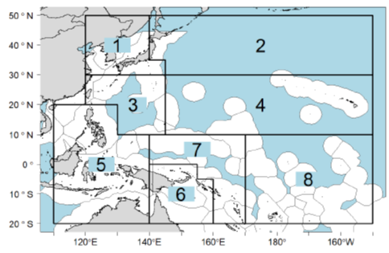

# Performance Indicators and Management Procedures Explorer (PIMPLE)

PIMPLE reference sheets are available (right-click to open in a new tab or save-as):

* <a href="PIposter.pdf" target="_blank">Performance indicators for skipjack</a>
* <a href="PIMPLEposter2sided.pdf" target="_blank">PIMPLE reference</a>

## What is PIMPLE?

PIMPLE is a tool for exploring and comparing the performance of alternative candidate management procedures (MPs) for WCPO skipjack.

A management procedure has three components:

1. Data collection
2. Estimation method (stock assessment model)
3. Harvest Control Rule (HCR)

For the current set of results, the data collection and estimation method are the same for each MP, and only the HCRs are different.
This means that we can directly compare the performance of the HCRs.

The aim is to select the HCR that is most likely to meet your management objectives.

The performance of each HCR is measured using different performance indicators (PIs).
PIMPLE can be used to explore and compare the PIs in a number of ways, using different plots and tables.
This allows trade-offs between the different HCRs to be evaluated.

Additional metrics, such as Kobe and Majuro plots, are also available.

The focus should be on the *relative* performance of the different HCRs, e.g. HCR X performs better than HCR Y.

## How to use PIMPLE

The main purpose of PIMPLE is to compare the relative performance of the candidate HCRs. This is most easily done using the **Compare performance** tab at the top of the screen.
This tab allows you to view the indicators using different plot types (see below).

To aid investigation it is possible to select the indicators that are of most interest, and deselect those that are of less interest.
Similarly, it is possible to select and deselect HCRs to focus attention on a smaller subset.

Other performance indicators can be found under the **Other indicators** tab at the top.
This allows you to see some of the PI in more detail, for example viewing the catch based indicators by model area.

## Model Areas

The model used for the evaluations has eight areas as seen here:

## Performance Indicators

Currently there are seven PIs included in PIMPLE.
Their numbers relate to their position in the original table of indicators. These numbers have been kept for convenience.

The average values of the PIs are calculated over three time periods:

* Short-term: 2022-2030
* Medium-term: 2031-2039
* Long-term: 2040-2048

With the exception of SB/SBF=0, all of the indicators have been scaled so that 'bigger is better', i.e. the larger the value, the better the MP is thought to be performing for that PI.

Some of the indicators are calculated over different model areas, or only calculated for certain subsets of fisheries and areas.

### SB/SBF=0

SB/SBF=0 is the ratio of the adult biomass to the adult biomass in the absence of fishing (sometimes known as depletion).
The value ranges between 0 and 1.
SB/SBF=0 is a measure of stock status and can be compared to the Limit Reference Point (LRP) of 0.2 and the Target Reference Point (TRP).

At the moment there is no adopted TRP for WCPO skipjack.
Instead the mean SB/SBF=0 in 2012 is used instead.

### 1. Probability of SB/SBF=0 being above the Limit Reference Point (LRP)

This indicator ranges between 0 and 1.
The higher the value, the smaller the chance of the stock falling below the LRP.
For example, a value of 1 means that there is no chance of falling below the LRP and a value of 0.9 means that there is a 1 in 10 (0.1) chance of falling below the LRP.

Higher values are preferred, depending on the level of risk that managers and stakeholders are prepared to accept.

### 3. Catches

The catches are presented as relative to the average catches in the period 2013 to 2015.
They are calculated over several groupings, based on area and fishery:

* Total catch over all areas and fisheries
* Purse seine catches in areas 6, 7 and 8
* Catches from all fisheries in individual areas

### 4. Relative Catch per Unit Effort (CPUE)

The CPUE is only calculated for the purse seines in areas 6, 7 and 8 (excluding the associated purse seines in area 6).
The CPUE is presented as relative to the CPUE in 2012.

### 6. Catch stability

Catch stability measures how variable catches are in time. 
The indicator ranges between 0 and 1. A value of 1 means that the catches do not change over time, i.e. they are constant.
A value of 0 means that the catches vary relatively strongly over time, compared to the other HCRs.

The indicator has been calculated over the same groupings as described for PI 3 (catches).
However, note that although the stability of catches can be compared across time different periods and HCRs, it cannot be compared between area groupings. 
For example, you cannot compare the stabilities in area 1 to the stabilities in area 2.

This indicator has also been calculated as the variability of relative catches (catches relative to the average catches in the period 2013 to 2015) over time.
The higher the variability, the more the catches change over time.
A variability of 0 means that the catches are not changing over time.

### 7. Effort stability

This is similar to PI 6 (catch stability).
It measures the stability of effort relative to the effort in 2012.
It is also possible to investigate the variability, as well as the stability.

As with PI 4 (Relative CPUE), this indicator is only calculated for the purse seines in areas 6, 7 and 8 (excluding the associated purse seines in area 6).

### 8. Proximity of SB/SBF=0 to the average SB/SBF=0 in 2012

(Note that as the TRP for skipjack is under discussion, this indicator has been updated to reflect how close the SB/SBF=0 is to SB/SBF=0 in the reference year of 2012)

2012 is taken to be a reference year for SB/SBF=0.
This indicator measures how close, on average, the SB/SBF=0 was to the mean SB/SBF=0 in 2012 (about 0.425).
The higher the value of the indicator, the closer SB/SBF=0 was to this reference value in each year, on average.
A value of 1 means that the SB/SBF=0 was exactly at the reference value in each year.
A value of 0 means that the SB/SBF=0 was as far from the reference value as possible in each year.

Note that this indicator is slightly different to comparing the average value of SB/SBF=0 to the reference value.
If the average value of SB/SBF=0 over a range of years is close to the reference value it does not necessarily mean that SB/SBF=0 was close to the reference value during those years.
For example, if SB/SBF=0 moved between 0.225 and 0.625 each year, the average value would be 0.425 but it would never have been very close to 0.425 in any year.

## Plot Types

There are four plot types available in PIMPLE: bar charts, box plots, time series plots and radar plots. Each of them displays the information in a different way.

          
