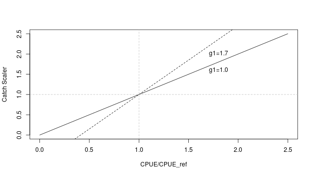
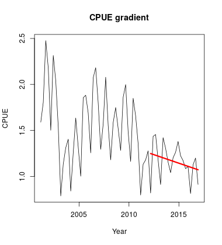
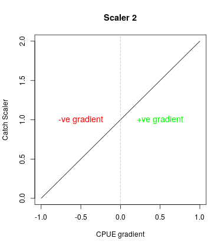
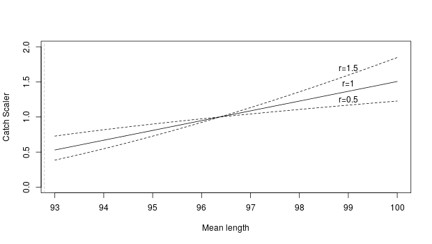

## One-phase CPUE based HCR (HCR1, HCR2 and HCR3)
The one-phase HCR is based on a simple linear relationship between relative CPUE and the resulting catch scaler.
The catch scaler for each management cycle is based on the recent observed CPUE averaged over a specified period ($Y_{ave}$), relative to a reference CPUE:

\begin{equation}
scaler=
g1*\frac{\overline{CPUE}}{CPUE_{ref}}+(1-g1) \\
\end{equation}
where $\overline{CPUE}$ is the average CPUE of the last $Y_{ave}$ years, $CPUE_{ref}$ is the reference CPUE, 
and $g1$ is a gain parameter that controls how reactive the HCR is to the average CPUE levels (Table.1). There is also an optional parameter $\Delta C_{max}$ that limits the amount that the catch scalar can change compared to its previous value.The list of the parameters are listed in Table.1.

*Figure 1. One-phase harvest control rule that relates fishing opportunity (catch scaler) to relative CPUE. The slope of the line can be modified to make the scaler more or less responsive to changes in CPUE (dotted lines).*

|    |  HCR parameters| Parameter name | Description                                |
|:---| :--------------:  |:------------------:| :-------------------------------------------|
| 1  |$g$  | Gain    |Determines how reactive the HCR is   |
| 2  | $Y_{ave}$     | Average years     |  Years to average over |
| 3  | $CPUE_{ref}$ | CPUE reference | The reference CPUE level against which the average CPUE is compared|
| 4  | $\Delta C_{max}$ | Maximum change in catch | The catch scaler can only increase or decrease by $\Delta C_{max}$ of the previous catch.|

*Table 1. one-phase CPUE based HCR parameters} Parameters and their description for one-phase HCR.*

The parameters used for HCR1, HCR2 and HCR3 are listed in Table 2. 

| HCR |  $Y_{ave}$   | $g$ | $CPUE_{ref}$ | $\Delta C_{max}$ |
|:-----|:--:|:-----:| :----:| :-----:|
| HCR 1  | 5 | 1.7   | 1.49 | 0 |
| HCR 2  | 5 | 1.0   | 1.49 |1.15|
| HCR3  | 3 | 1.0   | 1.29 | 0 |

*Table 2. Parameters for one-phase CPUE based HCR*

## Two-phase CPUE based HCR (HCR4, HCR5 and HCR6)

The two-phase HCR has two components, each returning an independent scaler for catch which are combined to return a single catch scaler.

Similar to the one-phase HCR, the scaler from the first component is determined from the ratio of $\overline{CPUE}$ to $CPUE_{ref}$.
The ratio is compared to two levels, $Trig_{up}$ and $Trig_{down}$, that determine whether the resulting scalar will have a value of 1, $S_{lower}$ or $S_{higher}$.

This first part of the rule has three outcomes: if $\overline{CPUE}$ is close to the $CPUE_{ref}$, catches are unchanged, otherwise they are scaled up or down accordingly (Figure.2):

\begin{equation}
scaler.1=
  \begin{cases}
	Trig_{up} < \frac{\overline{CPUE}}{CPUE_{ref}}, \quad S_{upper}\\
	Trig_{down} < \frac{\overline{CPUE}}{CPUE_{ref}} < Trig{up}, \quad 1.0 \\
	\frac{\overline{CPUE}}{CPUE_{ref}} < Trig_{down}, \quad S_{lower}
  \end{cases}
\end{equation}

The second component calculates the gradient of a straight line fitted to the time series of CPUE for the last $Y_{ave}$ years (Figure.2).
If CPUE is increasing the gradient of the line will be positive and the scaler will be greater than 1.
Conversely, if CPUE is decreasing the gradient will be negative and the scaler will be less than 1.
The scalar from the second component is calculated from the gradient and a gain parameter ($g2$) (Figure.2):

\begin{equation}
scaler.2= 1 + g2 * gradient + (1-g2)
\end{equation}

The resulting overall catch scaler from the HCR is calculated as the product of scaler 1 and scaler 2 (i.e. the two scalers multipled together).

\begin{equation}
scaler=scaler.1 * scaler.2 
\end{equation}

The description of each parameter is given in Table.3.
For the examples presented in this paper, an equal weighting was applied to each component of the HCR. A different weighting system can be discussed in the future. 

{width=30%} {width=30%}  {width=30%} 

*Figure 2. Two-phase harvest control rule: Phase 1 produces a simple scaler dependent on the relative CPUE ( $\overline{CPUE}$ to $CPUE_{ref}$). Phase 2 produces a scaler dependent on the gradient of the recent trajectory of CPUE (greater than 1 for +ve gradients and less than 1 for -ve gradients). The resulting scaler for management of the fishery is the product of scaler 1 and scaler 2.*

|    |  HCR parameters| Parameter name | Description                                |
|:---| :--------------:  |:------------------:| :-------------------------------------------|
| 1  | $Y_{ave}$      |CPUE average years     |  Years to average over |
| 2  | $trig_{up}$ | Upper trigger point for catch scaler increase | The trigger point that control the upper range of the $\frac{\overline{CPUE}}{CPUE_{ref}}$|
|	3  | $Trig_{down}$ | Lower trigger point for catch scaler reduction | The trigger point that control the lower range of the $\frac{\overline{CPUE}}{CPUE_{ref}}$ |
|4   | $S_{upper}$ |  Maximum catch scaler | If the $\frac{\overline{CPUE}}{CPUE_{ref}}$ is bigger than the $Trig_{up}$. The maximum scaler will apply|
|5   | $S_{lower}$ | Minimum catch scaler | If the $\frac{\overline{CPUE}}{CPUE_{ref}}$ is smaller than the $Trig_{down}$. The minimum scaler will apply|
|6   | $g$ | gain parameter | Determines how reactive the HCR is to the linear trend of the relative CPUE|

*Table 3. Parameters and their descriptions for two-phase HCR.*

The parameters used for HCR4, HCR5 and HCR6 are listed in Table 4. 

| HCR | $Y_{ave}$ | $Trig_{up}$ | $Trig_{down}$ |  $S_{upper}$ |  $S_{lower}$ | $g$ |
|:-----|:--:|:-----:| :----:| :-----:| :-----:| :-----:| :-----:| 
| HCR4  | 5 | 1.5   | 0.8 | 1.3 | 0.7 | 1.4 |
| HCR5  | 5 | 1.2   | 0.8 |1.3 | 0.7 | 1.0 |
| HCR6  | 3 | 1.6   | 0.2 | 1.8 | 0.2 | 1.0 |
 
*Table 4. Parameters for two-phase CPUE based HCR*

## Target rule mean length HCR (HCR7, HCR8 and HCR9)

The catch scaler for the target-based mean length HCR is adjusted up or down or unchanged from the previous year based on the recent observed mean length in catch ($\overline{L_{obs}}$) averaged over $Y_{ave}$ years (Figure.3). The target ($L_{tar}$) and limit ($L_{lim}$) represent the mean length in catch when stock depletion ($SB/SB_{F=0}$) reaches the biomass target reference point (TRP) and the biomass limit reference point (LRP), as determined from deterministic projections, respectively. The catch scaler for the target-based mean length HCR is based on the recent observed mean length in catch ($\overline{L_{obs}}$) averaged over $Y_{ave}$ years (Figure.3).

{width=70%}

*Figure 3.Target rule mean length harvest control rules: this harvest control rules is driven by the ratio of $\overline{L_{obs}}$ to the $L_{tar}$ and the $L_{lim}$ in catch.*

The parameters used for HCR1, HCR2 and HCR3 are listed in Table 5. 

|    |  HCR parameters| Parameter name | Description                                |
|:---| :--------------:  |:------------------:| :-------------------------------------------|
| 1  | $Y_{ave}$      |CPUE average years     |  Years to average over |
| 2  | $r$ | CPUE reference      |    The reference CPUE against which fishery opportunities is scaled|
| 3  | $L_{tar}$ | target mean length  | The mean length in catch when stock depletion ($SB/SB_{F=0}$) reaches the biomass target reference point (TRP) |
| 4  | $L_{lim}$   | limit mean length    | The mean length in catch when stock depletion ($SB/SB_{F=0}$) reaches the biomass limit reference point (LRP)  |

*Table 5. one-phase CPUE based HCR parameters} Parameters and their description for one-phase HCR.*

The parameters used for HCR7, HCR8 and HCR9 are listed in Table 6. 

| HCR | $r$ |
|:-----|:--:|
| HCR7  | 1 | 
| HCR8  | 0.5 | 
| HCR9  | 1.5 | 
 *Table.6 Parameters for mean length based HCR*

