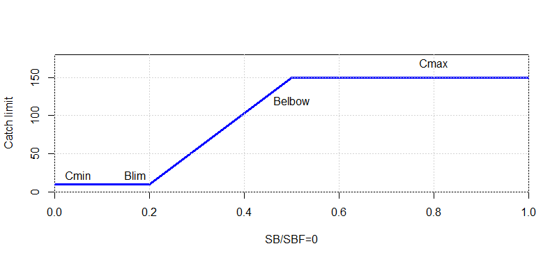
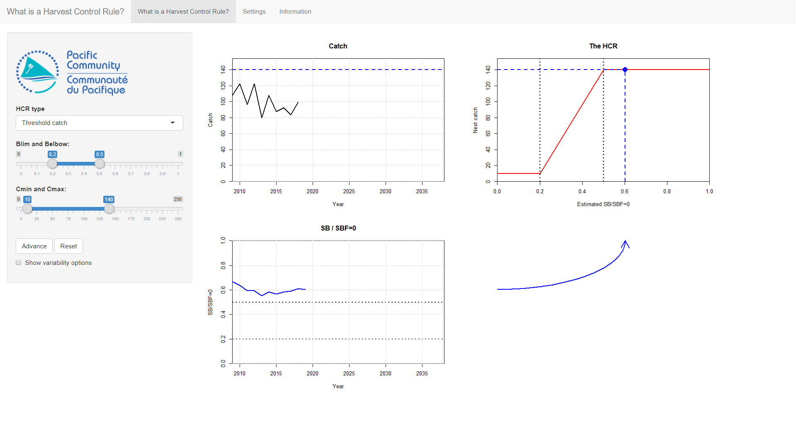
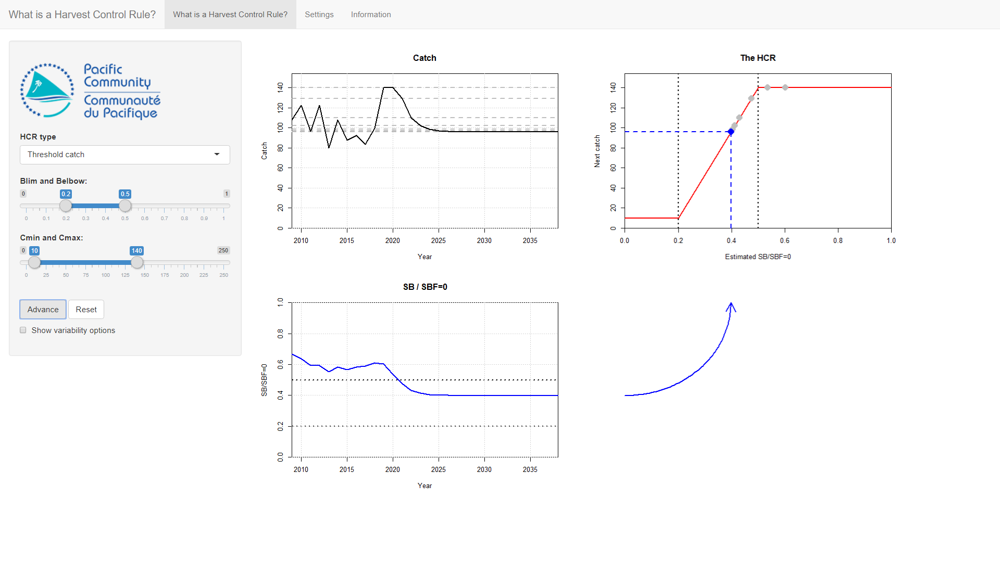
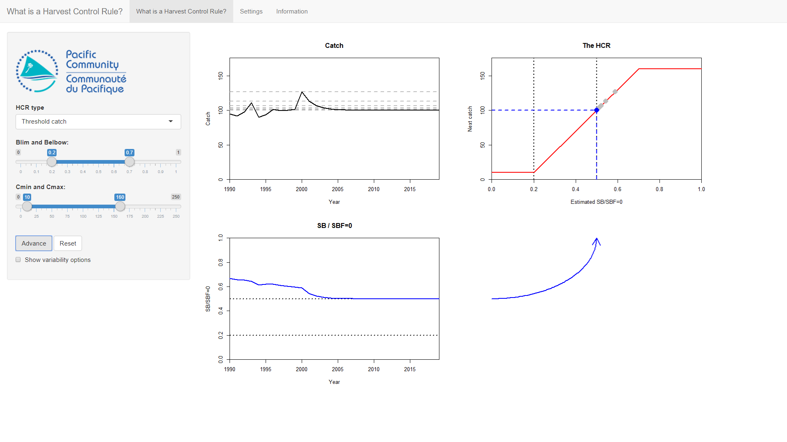
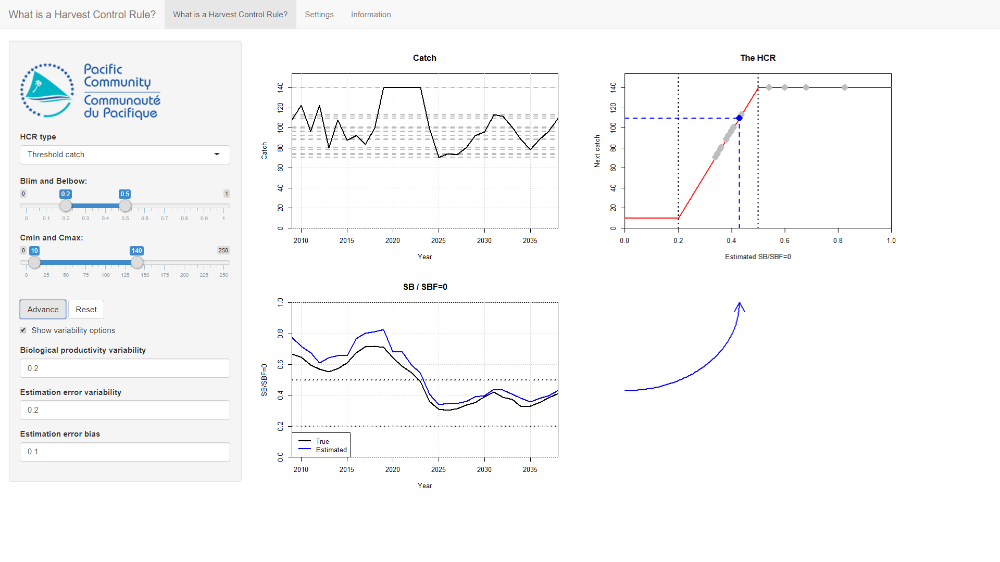

<!--use render()-->
<!-- render("tutorials/measuringPerformance.Rmd", output_format = "all")-->

```{r, results='hide', echo=FALSE, warning=FALSE, message=FALSE}
#library(kableExtra)
```

# Introduction to HCRs

This tutorial is a quick introduction to Harvest Control Rules (HCRs) and their use in fisheries managment.
It uses the *Introduction to HCRs* app from the *AMPED* suite of apps for exploring harvest strategies.

An HCR is a pre-agreed decision rule that is used to set fishing opportunities in the future. An HCR should be designed so that the management objectives of the fishery have the greatest chance of being achieved. A good HCR is robust to different sorts of uncertainty (which we will discuss later on).

In this tutorial we will use a simple HCR to set the catch limit of a fishery in every year.
The HCR takes an estimate of the current value of SB/SBF=0 (the amount of adult biomass compared to the amount of adult biomass if there was no fishing) and uses it to set a catch limit in the next year.
The catch limit is set according to the general rule shown in the figure below:



The current value of SB/SBF=0 is on x-axis along the bottom. The catch limit in the next year is on the y-axis on the side. The red line is the rule that sets the catch limit given the SB/SBF=0. 
The basic idea is that if SB/SBF=0 starts to fall, the catches are reduced. If the SB/SBF=0 starts to rise, the catches are increased.

The shape of the HCR is determined by 4 parameters: *Blim*, *Belbow*, *Cmin* and *Cmax*.
When the estimated SB/SBF=0 is greater than *Belbow* the catch limit is set at *Cmax*.
When SB/SBF=0 is less than *Blim* the catch limit is set at *Cmin*.
When SB/SBF=0 is betwen *Blim* and *Belbow*, the catch limit is set according to the slope.

Note that the fishery used in this tutorial is not based on a particular fishery or stock. It's just a made up example.

# Getting started

To get started double-click on the **IntroHCR** file in the *AMPED* directory.
A black window *should* appear, followed by the app opening in a browser window.
If this does not happen, something has gone wrong. Sorry...

If things have gone well you should see three plotting windows and a blue arrow.
Your plots might look slightly different due to variations in the historic catches.

<!-- Tried inserting image using appshot from webshot but it looked pretty crappy-->

<!-- Insert image -->


The two plots on the left-hand side show the history of the catch and SB/SBF=0. At the moment, there are only 11 years of history from 2009 to 2019.

The HCR is shown in the top-right panel.
As mentioned above, the shape of the HCR is determined by 4 parameters: *Blim*, *Belbow*, *Cmin* and *Cmax*.

The parameter values can be controlled using the sliders on the left-hand side of the screen.
The first thing to do is to set the parameters of the HCR to: *Blim* = 0.2, *Belbow* = 0.5, *Cmin* = 10 and *Cmax* = 140.
These are the default initial values, but make sure that they have set OK.

# Using the HCR

The purpose of the HCR is to set the catch limit each year. The HCR uses the current estimated value of SB/SBF=0 to set the catch limit. This rule will be applied every year in the future to set new catch limits in each year.

We start at the very beginning of 2019 and we want to use the HCR to set the catch limit for 2019.
The SB/SBF=0 can be seen in the bottom-left plot.

The way the HCR operates can be seen by following the blue arrow from the SB/SBF=0 plot, at the bottom left, to the HCR plot, at the top right. The current estimated value of SB/SBF=0 is shown on the HCR plot as the blue dashed vertical line.

The catch limit in the following year is set by reading the corresponding catch limit from the HCR.
This is shown by the blue dashed horizontal line on the HCR plot.
The new catch limit is also shown on the catch plot at the top-left, as the blue dashed line. This represents what the catches *will* be in 2019.

We can see how the HCR works by going forward a year.

Press the **Advance** button in the left panel. You have now advanced forward in time by a year. Several things have happened:

* The catch limit that was set by the HCR for 2019 has been used by the fishery. In the catch plot you should see that the catch in the year 2019 has reached this catch limit.
* The stock has responded to being fished in 2019 (SB/SBF=0 has probably gone down). You should see that we now have an extra year in the SB/SBF=0 plot up to 2020. The blue arrow to the right of the plot has moved to reflect the new estimate of SB/SBF=0. 
* The HCR has used this new value of SB/SBF=0 to set a new catch limit for 2020 (this may be the same value as the previous catch limit). The blue arrow connecting the SB/SBF=0 plot to the HCR plot may have moved as a response.

Press the **Advance** button again. The catch limit that was set for 2020 is used by the fishery. The stock responds to being fished again and we have a new estimate of SB/SBF=0 for the beginning of 2021. This new estimate of SB/SBF=0 is again used by the HCR to set the new catch limit for 2021 (the blue arrow will move again to reflect this).

Keep pressing the **Advance** button and you should see the cycle of how the HCR sets the catch limit, the catch limit affects the stock abundance, and the stock abundance is used by the HCR to set a new catch limit.
You should see that eventually the system settles down to a steady catch limit and stock abundance.



# Exercises

Press the **Reset** button in the left panel to clear the stock projection.
Run through the projection again by pressing the **Advance** button. Make sure that you understand how the HCR uses the last value of SB/SBF=0 to set the catch limit.

Keep pressing the **Advance** button until you get to the end of the projection. In the table below write down the final value of the catch and the final value of SB/SBF=0 that you see on the plots. Also, note down anything interesting (if anything) that you see. For example, is the catch at the start of the projection different to the catch near the end of the projection?

Different HCRs behave in different ways and some are better than others.
The parameters of the HCR that we just tried are: *Blim* = 0.2, *Belbow* = 0.5, *Cmin* = 10 and *Cmax* = 140.
<!--  Final catch = 100 Final B = 0.4 When does it settle: 10 yrs-->

To see this, set up a different HCR by changing the HCR parameters in the left panel. Change *Belbow* to be 0.3 and *Cmax* to 130. Keep the other two parameters the same.
You should see that the HCR plot has been updated to show the new shape of the HCR.

Notice that this HCR has a lower maximum catch than the previous HCR. However, the catches do not start to reduce until SB/SBF=0 is much lower (as *Belbow* is 0.3).

As before, repeatedly press the **Advance** button and follow the evolution of the stock and the catches.
Note how the behaviour of the catch and SB/SBF=0 are different to the initial example.
Write down the final values and any observations in the table at the end of this section.

<!-- figure-->


As a final example set *Belbow* to 0.8 and *Cmax* to 150 and keep the other parameters the same. Notice that this HCR has a higher maximum catch but starts reducing the catches at a higher level of SB/SBF=0.
Again, repeatedly press the **Advance** button and follow the evolution of the stock and catch limits. Write down the behaviour and final values in the table.


<!-- figure-->



<!-- Make both latex and html tables - one is used for PDF the other for HTML-->

<!-- Latex for PDF -->

\begin{table}[H]
\begin{tabular}{| c | C{3cm} | C{3cm} | C{5cm} |}
\hline
& Final catch & Final SB/SBF=0 & Notes \\ \hline
HCR 1   &             &                &       \\ 
\footnotesize{(\textit{Belbow}=0.5, \textit{Cmax}=140)}    &             &                &\\
&&&\\ 
&&&\\ 
&&&\\ \hline
HCR 2   &             &                &       \\ 
\footnotesize{(\textit{Belbow}=0.3, \textit{Cmax}=130)}    &             &                &\\
&&&\\ 
&&&\\ 
&&&\\ \hline
HCR 3   &             &                &       \\ 
\footnotesize{(\textit{Belbow}=0.8, \textit{Cmax}=150)}    &             &                &\\
&&&\\ 
&&&\\ 
&&&\\ \hline
\end{tabular}
\end{table}


<!--
Final values
1: 0.4, 95
2: 0.25, 75
3: 0.59, 100
-->

You should have seen that different parameterisations of the HCR lead to different fishery dynamics and final settled values.

# Introducing uncertainty

In the real world, fisheries management is affected by different types of uncertainty.
However, the projections we have run so far have not considered uncertainty.
This means that if we rerun the same projection, the outcome will always be the same (they are known as *deterministic* simulations).

Because there is lot of uncertainty in fisheries, it is very important to choose an HCR that is robust to this uncertainty, otherwise the outcome may not be what you expected.
For example, an HCR that performs well when future stock recruitment is stable may not perform well when stock recruitment varies a lot.
We will look at this here.

We can include two sources of uncertainty: variability in the biological productivity and estimation error.
Both of these sources of uncertainty can affect the dynamics of the fishery and the performance of the HCR.

Click on the **Show variability option** option in the panel on the left to show the uncertainty options.

## Biological productivity variability

Biological productivity variability reflects the natural variability in the stock dynamics, for example through variability in the recruitment, growth and natural mortality.
Fisheries managers have no control over this source of uncertainty.
As such it is very important that an adopted HCR is robust to this uncertainty.

We saw in the previous examples without uncertainty that eventually the stock abundance settles down to a constant value.
What happens when we include natural variability?

Set the HCR parameters back to their original values (*Blim* = 0.2, *Belbow* = 0.5, *Cmin* = 10, *Cmax* = 140).
Increase the **Biological productivity variability** to 0.2 and project forward through time using the **Advance** button.

<!-- figure-->


You should see that the SB/SBF=0 now bounces around and is not perfectly flat.
This is because the variability in the stock productivity is affecting the abundance.
In some years the stock is more productive than it is in other years. This causes fluctuations in the population abundance.
As the HCR uses the estimate of SB/SBF=0 to set the catch limit, it means that the catch limit set by the HCR also bounces around. This then goes onto affect the stock abundance and so on.

If you press the **Reset** button and run the projection again you should see that you get a different trajectory (uncertainty in action!).

## Estimation error

In the real world we do not know the true stock abundance. This means that the HCR is not driven by the *true* value of SB/SBF=0. Instead it is driven by an *estimated* value.
For example, SB/SBF=0 can be estimated by using a stock assessment model.
The catch limit that is set by the HCR is therefore based on estimated values of the stock abundance, not the true values.
The difference between the estimated and true value of SB/SBF=0 is called the estimation error and it can have an important impact on the performance of a HCR.

Here estimation error can be set using two ways: *variability* and *bias*. These can be combined.

To demonstrate these turn the **Biological productivty variability** back to 0 and increase the **Estimation error variability** to 0.2 (leave **Estimation error bias** as 0 for now).
Project the stock forward several times using the **Advance** button.

<!-- figure-->


You should see that the SB/SBF=0 plot now shows two lines. The black one is the *true* abundance and the blue one is the *estimated* abundance. It is the estimated abundance that is used by the HCR to set the catch limit.

You should see that the stock and catch bounce around. This variability is not caused by any biological variability (you have turned that off) but from the HCR using the *estimated* value of SB/SBF=0 to set the catch limit. The catch limit, of course, affects the *real* stock abundance.

If you press **Reset** and run the same projection again by pressing **Advance** you should see a slightly different outcome. Try it.

Now turn the **Estimation error variability** back to 0 and set the **Estimation error bias** to 0.1.
This means that the estimated value of SB/SBF=0 is always 10% higher than the true value, i.e. we are always overestimating the stock abduncance.
Project forward and see what happens. Compare the *true* final values of SB/SBF=0 (the black line on the plot) and catch to the numbers you wrote down in the table above for the first HCR.
Are the final values higher or lower than when there is no bias?
<!-- I get lower values than when no bias -->


## Combining uncertainty

As mentioned above, fisheries management is affected by many types of uncertainty.

Now turn on all the sources of uncertainty.
Set **Biological productivity variability** to 0.2, **Estimation error variability** to 0.2 and the **Estimation error bias** to 0.1.
Keep the HCR values the same as the initial values (*Blim* = 0.2, *Belbow* = 0.5, *Cmin* = 10 and *Cmax* = 140).

Project this forward. How are the results different to the first projection we ran which had the same HCR parameters but no uncertainty?




# Exercises

Use the same three HCRs that we used above.
For each HCR, run about 5 full projections. Note down the final *true* SB/SBF=0 (the black line on the plot) and the final catch.
Also note down any interesting behaviour.

From this, which HCR do you prefer?
It's probably quite hard to say at this stage. We shall look at this more closely in the next tutorial...

\begin{table}[H]
\begin{tabular}{| c | C{3cm} | C{3cm} | C{5cm} |}
\hline
HCR & Final catch & Final SB/SBF=0 & Notes \\ \hline
1   &             &                &       \\ 
\footnotesize{(\textit{Belbow}=0.5, \textit{Cmax}=140)}    &             &                &\\
&&&\\ 
&&&\\ 
&&&\\ 
&&&\\ 
&&&\\ \hline
2   &             &                &       \\ 
\footnotesize{(\textit{Belbow}=0.3, \textit{Cmax}=130)}    &             &                &\\
&&&\\ 
&&&\\ 
&&&\\ 
&&&\\ 
&&&\\ \hline
3   &             &                &       \\ 
\footnotesize{(\textit{Belbow}=0.8, \textit{Cmax}=150)}    &             &                &\\
&&&\\ 
&&&\\ 
&&&\\ 
&&&\\ 
&&&\\ \hline
\end{tabular}
\end{table}


# Summary

A HCR is a decision rule for setting future fishing opportunities.
In this example the input to the rule is the *estimated* stock abundance (SB/SBF=0) and the output is the catch limit in the following year.

We have seen that different HCR parameterisations give different performances.

Uncertainty is a big concern in fisheries management.
Here we looked at biological and estimation uncertainty. We have seen that they can change the performance of the fishery.
It is very important that an HCR is robust to uncertainty.
A HCR that performs well in the absence of uncertainty may not perform as well when uncertainty is present.

How do we know which HCR to use? How do we consider uncertainty?
See the next tutorial!

<!--
(By the way We haven't considered time lags yet...)
-->


