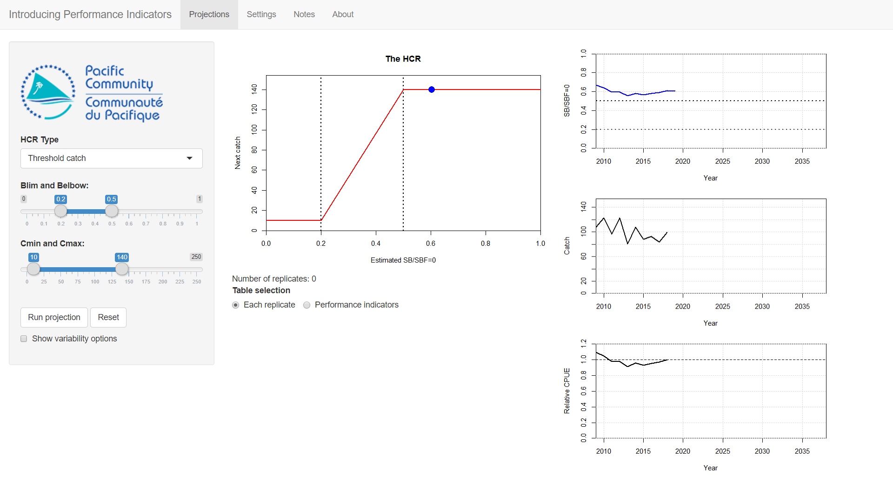
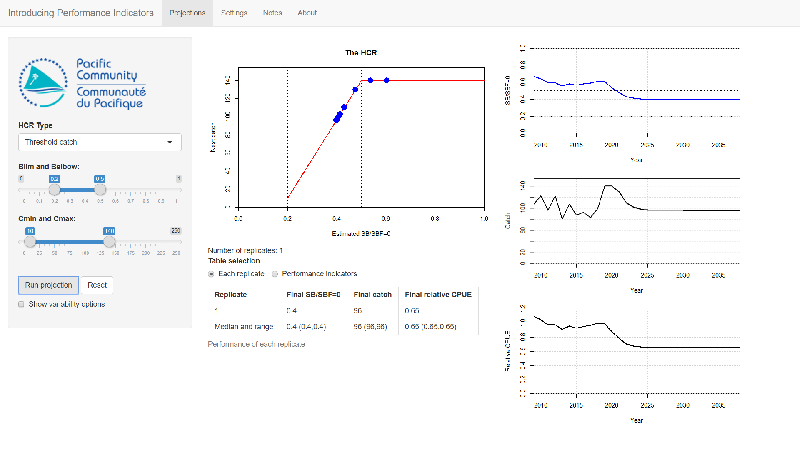
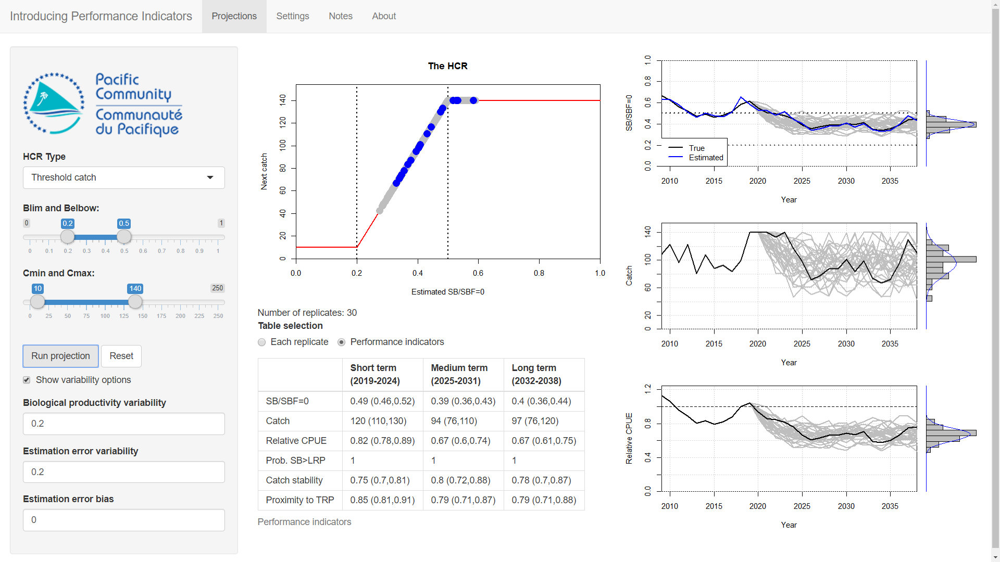

<!--
output:
  tufte::tufte_handout: default
  
  
  pdf_document:
    includes:
      in_header: mystyle.sty
fontsize: 12pt
  
  
  -->

<!--use render()-->
<!-- render("tutorials/introIndicators.Rmd", output_format = "all")-->

# Introduction

The previous tutorial (*Introduction to HCRs*) introduced Harvest Control Rules (HCRs) and how they can be used to set future fishing opportunities based on estimates of stock status.
This allowed us to see the basic ideas of how a HCR worked and we saw that different HCRs can perform differently.
We also looked at two sources of uncertainty (*biological productivity variability* and *estimation error*) and saw that they can affect the performance of a HCR.

Before a HCR is adopted its performance is tested and evaluated using computer simulations (known as Management Strategy Evaluation - MSE).
During these evaluations the performance of a proposed HCR is measured by using a collection of indicators, known as performance indicators (PIs).
These indicators should relate to the agreed management objectives of the fishery, e.g. stock sustainability, good economic performance etc.
These PIs are used to select the HCR that is then adopted and put into operation.

Fisheries management is affected by many sources of uncertainty, including uncertainty about the biology of the stock and the stock status. It is very important to understand how an HCR performs under uncertainty.
Therefore, the evaluations have to consider different sources of uncertainty.

To understand the impact of uncertainty on the performance of an HCR, the evaluations are performed many hundreds of times, where each evaluation is known as a replicate.
The PIs are calculated for each replicate and summaries, such as average values and ranges, are presented.

In this tutorial we start to look at how PIs can be used to measure the performance of a HCR.
Particular attention is paid to how uncertainty can be included in the evaluations and the effect it can have on the PI values.

# Starting Up

Start by double-clicking on the **IntroIndicators** file in the *AMPED* directory.
A black window *should* appear, followed by the app opening in a browser window.
If this does not happen, something has gone wrong. Sorry...

The layout of the app should show the HCR in the middle, with three time series plots of SB/SBF=0, catch and CPUE (relative to the CPUE in 2018) on the right-hand side and the control buttons on the left-hand side.
There should already be 10 years of catch, SB/SBF=0 and CPUE data in the plots.

Underneath the HCR plot is something about **Table selection**. The option *Each replicate* should be selected.

<!-- Insert image -->

The initial values of the HCR parameters should be: *Blim* = 0.2, *Belbow* = 0.5, *Cmin* = 10 and *Cmax* = 140.
If they are not you can set them using the controls in the left panel.

# Run a Projection

In the previous tutorial, when you clicked the **Advance** button, you projected forward by a single year.
This meant that to run a full projection you had to keep pressing the **Advance** button.

In this tutorial, when you run a projection you will project forward from 2019 to 2039 with a single button press.
The HCR is applied in each year of your projection, and the corresponding catch limit used.
It's exactly the same as what we were doing before, it's just that now it happens automatically without you having to press the **Advance** button lots of times.

Try this now by pressing the **Run projection** button in the left panel to perform a 20 year projection (from 2019 to 2039).

<!-- Insert image -->

You should see that the time series plots now show the full time series until 2039.
The HCR was applied in each year of the projection and the HCR plot has blue points on it to show which bits were used during the projection.
The catch and SB/SBF=0 plots should look like the ones we saw in the previous tutorial.

A table should also appear underneath the **Table selection** control.
This table shows the values of *SB/SBF=0*, *Catch* and *Relative CPUE* in the final year of the projection.
We will initially uses these performance indicators to evaluate the performance of HCRs.

As we run more projections, more rows will appear in the table.
Each projection is known as a replicate.
As we have only run one projection, we only have one replicate in the table.
The final row of the table gives the median, or average, value and 10-90 percentiles (in brackets) of the final values over all replicates.
The 10 and 90 percentiles are the low and high bounds of the range of values of the indicators. The majority of values of the PI falling between them.
Again, as we have only run one replicate the median and percentiles row currently shows the same information as the other row.

Click **Run projection** again. This runs *exactly the same* projection as the last one.
It is the same as the last one as we have not included any uncertainty in the projections.
Another row has appeared in the table to show the final values of the this replicate.
The summary values in the final row are also exactly the same.
These values are the same as the first replicate.

You may notice that the **Number of replicates** counter under the HCR plot also increased by one and that weird bars appearing at the end of the time series plots.

You can keep clicking **Run projection** to add more replicates to the table.
However, we have no uncertainty in the projection so we just running exactly the same projection over and over again with the same result. Each replicate is exactly the same.

# Introducing Uncertainty

Press the **Reset** button to clear out the plots and tables.

We want to know how well our HCR is going to perform under uncertainty.
We introduced uncertainty in the previous tutorial (*Introduction to HCRs*). As in the previous tutorial here we have two sources of uncertainty: *Biological productivity variability* and *Estimation error*.

Click on the **Show variability options** to show the uncertainty options.
Set **Biological productivity variability** to 0.2,  **Estimation error variability** to 0.2 and leave **Estimation error bias** at 0.
Keep the HCR parameters the same.

Click **Run projection** to project over the full time series. As we now have uncertainty you should see that the plots are bumpy.
This bumpiness is caused by the variability in the biological growth processes and through uncertainty in the stock status that is used to drive the HCR.
A line will also have appeared in the replicate table that records the final values of SB/SBF=0, catch and relative CPUE.
These values should be different to when we ran the projections with no uncertainty.

Click **Run projection** again. You should get another line on the plots.
The new line is different to the previous one (the previous one is now in grey, the new one in black).
Another line will also have appeared in the table to record the final values of this replicate.
The final values will be different to the values from the first replicate.
The median and the percentiles in the bottom line of the table will have been updated.

This second projection has the same stock and the same HCR as the first one but the outcome is slightly different.
The difference is a result of the uncertainty in the biological productivity and the estimation error.
The different projections are known as replicates.

Click **Run projection** again and again. More lines will appear on the plots and in the table.
Each line will be different because each projection is different.

The bars at the end of the time series plots are histograms of the values in the final year of each projection.
These histograms will fill in the more projections you run.

Keep clicking **Run projection** until you get 30 or more iterations.
You can see the histograms of the final values of the projection start to settle down.
Also, the 10-90 perentiles in the brackets in the final row of the table will not change so much with each new projection.
This means that we are starting to understand the distribution of values we would expect from this HCR.
This is very important when it comes to selecting a HCR for a fishery.
An HCR must be robust to uncertainty, otherwise it will not perform as well as expected.

<!-- Insert image -->

The histograms and the percentiles tell us how certain we are about the future.
If the histogram is wide, then there is a wide spread of values and we are not certain about what will happen.
If the histogram is narrow then we have more confidence in the projection.
This is important because sometimes it is better to choose an HCR that results in a lower value of catch but with more certainty, than an HCR that may give higher catches but with less certainty.

These types of projections with uncertainty are different to running a single deterministic (non-random) projection. 
If we want to understand how uncertainty may affect the performance of a HCR in the real world, running a deterministic projection without uncertainty is not enough.

# Measuting Performance: Exercise

In this exercise you will test the performance of three different HCRs and note down the values of the three PIs: *Catch*, *SB/SBF=0* and *Relative CPUE* in the final year.

Press the **Reset** button.
Use the same HCR parameters as above (*Blim* = 0.2, *Belbow* = 0.5, *Cmin* = 10 and *Cmax* = 140).
Use the same uncertainty setttings as above (*Biological productivity variability* = 0.2, *Estimation error variability* = 0.2, *Estimation error bias* = 0).

Run 30 iterations by pressing the **Run projection** button 30 times. 

Looking at the final row of the table, write down the median and the 10-90 percentiles (the values in the bracket) of SB/SBF=0, catch and relative CPUE in the final year.

For example, having just run this on my machine, for SB/SBF=0 I get a median value of 0.39 and percentiles of 0.34 and 0.45.
This means that the *most likely* final value of SB/SBF=0 will be 0.39, but the range of possible values is from 0.34 to 0.49.

<!--
SB/SBF=0 0.39 (0.34, 0.45)
Catch 91 (75, 120)
CPUE 0.83 (0.72, 0.95)
-->

Now try a different HCR.
Set these parameters: *Blim* = 0.2, *Belbow* = 0.3, *Cmin* = 10 and *Cmax* = 130 in the panel on the left.
Keep the same uncertainty settings.
Run 50 iterations of this HCR by pressing the **Run projection** button 50 times and note down the range and average values of SB/SBF=0, catch and CPUE.

<!--
SB/SBF=0  0.27 (0.22, 0.29)
Catch 80 (21, 120)
CPUE  0.36 (0.29, 0.39)
-->

Finally, try this HCR: *Blim* = 0.2, *Belbow* = 0.7, *Cmin* = 10 and *Cmax* = 150, project for 50 iterations and note down the values.

<!--
SB/SBF=0  0.52 (0.47, 0.57)
Catch, 100 (87, 120)
CPUE  1.0 (0.92, 1.1)
-->

\begin{table}[H]
\begin{tabular}{| c | C{3.5cm} | C{3.5cm} | C{3.5cm} |}
\hline
& Catch & SB/SBF=0 & CPUE \\ \hline
HCR 1   &             &                &       \\ 
\footnotesize{(\textit{Belbow}=0.5, \textit{Cmax}=140)}    &             &                &\\
&&&\\ 
&&&\\ 
&&&\\ 
&&&\\ 
&&&\\ \hline
HCR 2   &             &                &       \\ 
\footnotesize{(\textit{Belbow}=0.3, \textit{Cmax}=130)}    &             &                &\\
&&&\\ 
&&&\\ 
&&&\\ 
&&&\\ 
&&&\\ \hline
HCR 3   &             &                &       \\ 
\footnotesize{(\textit{Belbow}=0.8, \textit{Cmax}=150)}    &             &                &\\
&&&\\ 
&&&\\ 
&&&\\ 
&&&\\ 
&&&\\ \hline
\end{tabular}
\end{table}

## Questions

We will now use the three indicators (*Catch*, *SB/SBF=0* and *Relative CPUE* in the final year) to investigate the performance of the three HCRs tested above.

*Question 1:* Which of the three HCRs would you choose if you wanted to have the highest average relative CPUE in the final year?

*Question 2:* Which of three HCRs would you choose if you wanted SB/SBF=0 in the final year to be as close as possible to the Target Reference Point (TRP) of 0.5?

*Question 3:* Which of the three HCRs has the highest *uncertainty* in the catch in the final year (i.e. the biggest range of catch values)?

# Introducing Performance Indicators

In the exercise above, we compared the values of catch, SB/SBF=0 and relative CPUE in the final year. 
We used these metrics as *Performance Indicators* (PIs) to evaluate the performance of the three HCRs.

Lots of different PIs are available that measure different things. For example, PIs can measure catch levels, changes in effort, probability of SB/SBF=0 being above the limit reference point (LRP) etc. 

When comparing HCRs, the chosen PIs should relate to the management objectives for the fishery.  This allows you to measure how well the fishery is performing in relation to those objectives.
Some HCRs will perform well for some PIs and poorly for others. This is where the ideas of prioritising PIs and evaluating trade-offs come in.

In the previous exercise we only looked at the values of catch, SB/SBF=0 and CPUE in the final year of the projection.
We have not considered what happens during the course of the projection, only what happens at the end, i.e in the very long term.
When comparing HCRs we should also compare what happens in the short- and medium-term as well as the long-term.

# Measuring Performance

We will now to start to look at different PIs, over three time periods.

Press the **Reset** button.
Set the HCR parameters to: *Blim* = 0.2, *Belbow* = 0.5, *Cmin* = 10 and *Cmax* = 140.
Leave the uncertainty parameters as they are (*Biological productivity variability* = 0.2, *Estimation error variability* = 0.2, *Estimation error bias* = 0).

Select *Performance indicators* from the **Table selection** control.
Now press the **Run projection** button.

As before, new lines have been added to the three time series plots.
You should also see that a new table has appeared with various PIs in it.
The PIs are in the rows in the table.
The PIs are measure over different time periods, short-, medium- and long-term, which are the columns.
The values in the table are the median (average) of the replicates.
The values in the () are the 10 and 90 percentiles.
The 10 and 90 percentiles represent low and high bounds of the PI values with the majority of values falling between them.

There are 6 PIs in the table.
Three of them we have already used above: *SB/SBF=0*, *Catch* and *Relative CPUE*.
The three new ones are: *Prob. SB>LRP* (the probability of SB/SBF=0 being above the LRP) and *Catch stability* (a measure of how much the catch changes over time) and *Proximity to TRP* (how close the SB/SBF=0 is to the Target Reference Point - TRP).

The *Catch stability* goes between 0 and 1. A value of 1 means that the catches are stable and do not change over time. A value close to 0 means that the catches are very variable and change a lot over time.
You probably want your catches to be stable, rather than changing frequently, so the higher the value of this indicator, the better.

A high value for *Prob. SB>LRP* is preferred because you want to be safely away from the Limit Reference Point (LRP).
However, how much you are prepared to risk SB/SBF=0 falling below the LRP is a management decision.
A low value means that you have high probability of being below the LRP which is bad. The value of the LRP is 0.2.
Note that the *Prob. SB > LRP* PI does not have percentiles (no values in brackets). This is because it is a probability.

The *Proximity to TRP* measures how close the SB/SBF=0 is to the Target Reference Point (TRP).
This indicator ranges between 0 and 1. A value of 1 means that SB/SBF=0 is exactly at the TRP.
A low value means that SB/SBF=0 is far from being at the TRP.
Note that this can mean the SB/SBF=0 is *above* the TRP as well as being *below* it. The value of the TRP is 0.5. Ideally, you want to be close to the TRP so you want this indicator to be as high as possible.

Click the **Run projection** button again so that we have two replicates. Notice that the values in the table have changed.

It doesn't make much sense to calculate the median or the percentiles this for just 2 iterations.
Keep clicking **Run projection** until you have about 30 iterations.
You should see that the numbers in the table start to settle down (in the same way that the histogram settles down).

In the previous exercise we only looked at the final values.
Now, you can see the difference between the short-, medium- and long-term values.
For example, you may find that the short-term catches are higher than the long-term catches.
Different HCRs will perform better over different time periods and this will affect which HCR you prefer.

# Exercise

We are going to look at some PIs to help us choose between the three HCRs we looked at above.

The three HCRs are:
HCR 1 (*Blim* = 0.2, *Belbow* = 0.5, *Cmin* = 10 and *Cmax* = 140),
HCR 1 (*Blim* = 0.2, *Belbow* = 0.3, *Cmin* = 10 and *Cmax* = 130)
and HCR 3 (*Blim* = 0.2, *Belbow* = 0.7, *Cmin* = 10 and *Cmax* = 150). 

To do this we are going to record the values for only three of the PIs: *Catch*, *Catch stability* and *Prob. SB>LRP*, in the different time periods, in the table below.
Use the same uncertainty settings as above (*Biological productivity variability* = 0.2, *Estimation error variability* = 0.2, *Estimation error bias* = 0).

For each HCR, run 30 iterations (by pressing **Run projection** 30 times)

<!--

HCR 3 has worse catch, and catch variability in the short term. Otherwise it is better

-->

\begin{table}[H]
\begin{tabular}{| c | C{3.5cm} | C{3.5cm} | C{3.5cm} |}
\hline
& Catch & Catch stability & Prob. SB>LRP \\ \hline
HCR 1   &             &                &       \\ 
\footnotesize{(\textit{Belbow}=0.5, \textit{Cmax}=140)}    &             &                &\\
Short-term &&&\\ 
&&&\\ 
Medium-term&&&\\ 
&&&\\ 
Long-term&&&\\ \hline
HCR 2   &             &                &       \\ 
\footnotesize{(\textit{Belbow}=0.3, \textit{Cmax}=130)}    &             &                &\\
Short-term &&&\\ 
&&&\\ 
Medium-term&&&\\ 
&&&\\ 
Long-term&&&\\ \hline
HCR 3   &             &                &       \\ 
\footnotesize{(\textit{Belbow}=0.8, \textit{Cmax}=150)}    &             &                &\\
Short-term &&&\\ 
&&&\\ 
Medium-term&&&\\ 
&&&\\ 
Long-term&&&\\ \hline
\end{tabular}
\end{table}

## Questions

*Question 1:* Which HCR has the highest catches in the short-term?

*Question 2:* Which HCR has the highest catches in the long-term?

*Question 3:* Which HCR has the highest catch stability in the short-term?

*Question 4:* Which HCR has the highest catch stability in the long-term?

*Question 5:* In this example, is the indicator *Prob. of SB>LRP* helpful in choosing between the HCRs?

*Question 6:* By looking at the indicators in the different time periods, which of the HCRs do you prefer and why?

# Summary

In this tutorial we started to use Performance Indicators to measure the performance of different HCRs.
The indicators allow us to compare the performance of candidate HCRs.
The performance in different time-periods, not just the long-term, is important (it's not just the final destination, but the journey).

Additionally, HCRs need to be robust to uncertainty.
In this tutorial we have seen that when we include uncertainty, it is necessary to run many projections to allow us to understood how the HCR is going to perform.

In this tutorial we have 6 indicators over 3 time periods giving us a total of 18 PIs to consider. Each PI is reported as a median (average) value plus the 10th and 90th percentiles.
This is a lot of information to process!
You can see that considering more and more indicators can quickly lead to an overwhelming amount of information.
How we try to understand all of it is covered in the next tutorial.