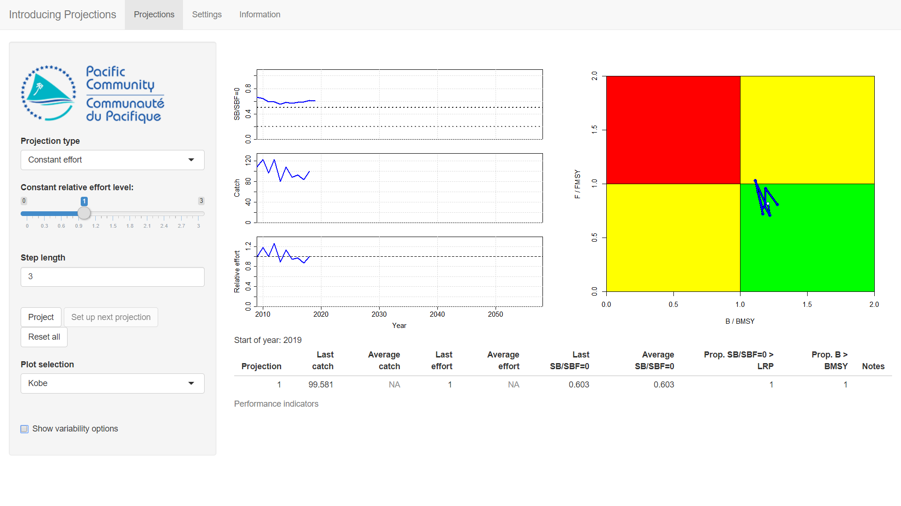
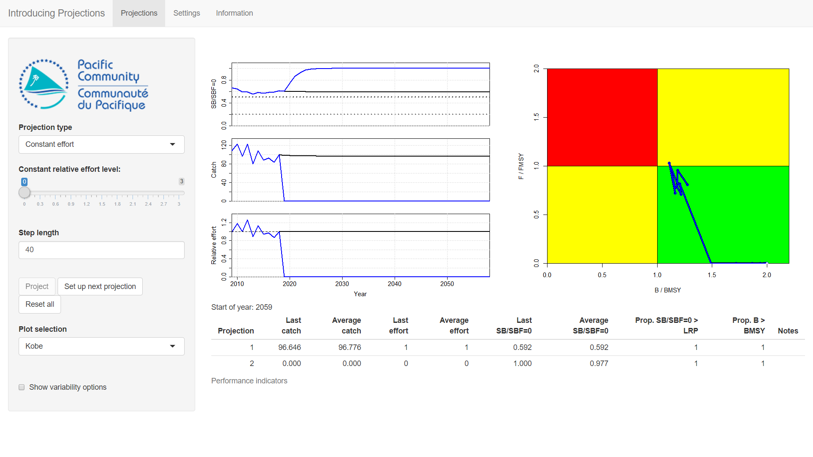
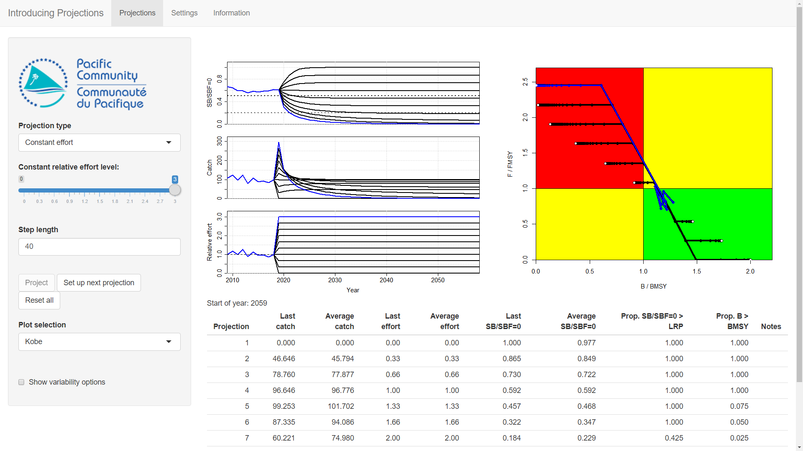
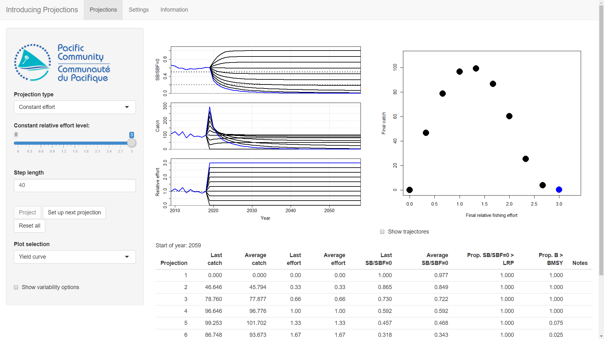
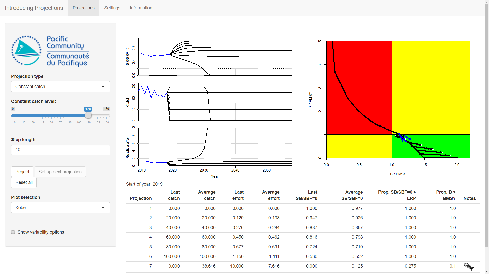
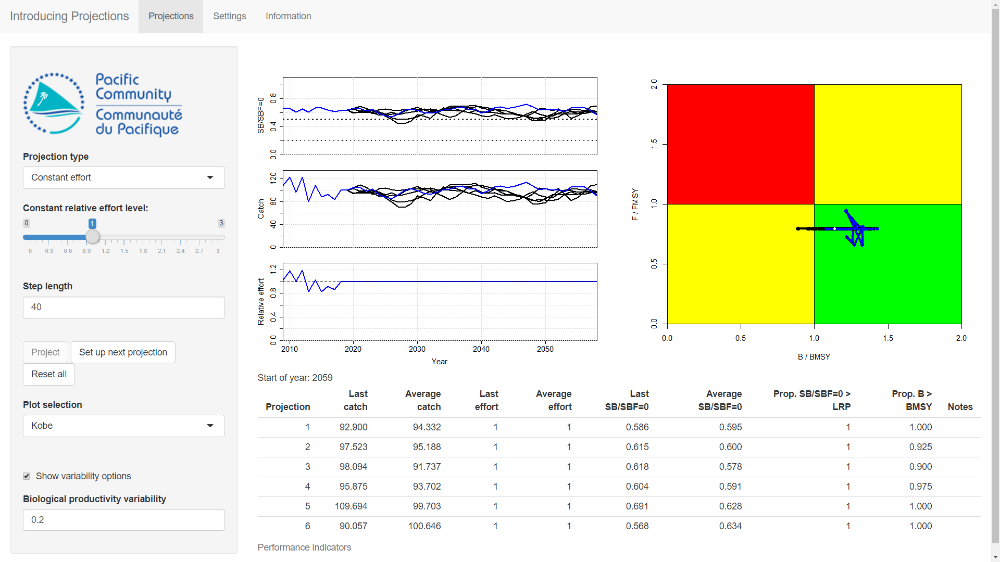

<!--use render()-->
<!-- render("tutorials/introProjections.Rmd", output_format = "all")-->

# Introduction to projections

Projections allow us to ask *"what if?"* questions and explore the answers.
For example, *"what do we think will happen if we continue to fish at the same level?"* or "*what do we think will happen if we increase the current level of fishing effort?*".

Trying to answer these questions is an important part of providing scientific advice to fisheries managers.
Scientists do not claim that their projections are perfect (we do not have a magical crystal ball) but they are important for understanding and exploring possible consequences of different actions.
Sometimes the resulting advice can only be given qualitatively ("If you do action A, something bad will probably happen. If you do action B, something good will probably happen").
Also, the further we look into the future, the less certain we are about we think will happen ("Do you know what you are doing this time tommorow? Do you know what you are doing this time next year?"). 
However, it is better to have some idea about what we think will happen than no idea at all.

In this practical we will be asking ourselves lots of *"what if?"* questions about a fishery and exploring the possible consequences. 
We will do this by projecting a simulated fish stock into the future under different fishing conditions.
Note that the fish stock that we are going to play with is not based on a real stock. It is just a toy.

# Getting started

## Fire it up

To get started double-click on the **IntroProjections** file in the *AMPED* directory.
A black window *should* appear, followed by the app opening in a browser window.
If this does not happen, something has gone wrong. Sorry...

## Quick tour

You should see something that looks like this:

<!-- figure-->

The panel on the left-hand side has the controls, the main panel has some plots.
On the left-hand side of the main panel there are three time-series plots: *SB / SBF=0* (the adult biomass as a proportion of the adult biomass if there was no fishing), *Catch* (the total catches in that year) and *Relative effort* (the fishing effort relative to the fishing effort in the year 2018).
Note that your plots may have slightly different values in them.

On the right-hand side of the main panel is either a *Kobe* plot, a *Majuro* plot or a *Yield* plot depending on the option selection in the **Plot selection** menu on the far left-hand side.

At the bottom of the main panel is a table. At the moment it only has one line. Don't worry about this for the moment.

To start with we only have 10 years of historical data (from 2009 to 2018).
It will be our job to run projections of different future fishing scenarios.

There are some decisions we need to make when running the projections. Are we going run a projection based on controlling future effort or catches?
How long do we want the projections to run for?

The controls in the panel on the left-hand side allow us to make these decision. We can choose between running an *effort* or *catch* based projection using the **Projection type** control, i.e. we can set a target effort or catch level and investigate the consequences.
We can choose how long we want to project for using the **Step length** control.
There is also a check box that says **Show variability options** at the bottom. Ignore this for now.

# Constant effort projections

To start with, we will explore the consequences of running projections with constant fishing effort.

## A quick example

We want to run a 40 year projection until the end of 2059.
At the moment the **Step length** is only set to 3. Change this to 40, so that we will run a 40 year projection.

The **Projection type** should already be set to **Constant effort**.
This means that we will be running a projection with fixed effort for the duration of the **Step length** that we have just set.

The **Constant relative effort level** slider sets the amount of effort to be used in the projection. Note that this effort is *relative* to the fishing effort in 2018. You can see in the time-series plot of effort that the value in 2018 is 1.
The default value of the **Constant relative effort level** slider is 1. If it is not already set to 1, do so now.

Set the **Plot selection** to *Kobe* (if not already).

We are now ready to run our projection. The question we are asking here is *"what do we think will happen if we fish at a relative effort of 1 for the next 40 years?"*.
Press the **Project** button to find out.

<!-- figure-->

You should see that the the time-series plots now go to the end of the time-series. The Kobe plot has also been updated with the stock trajectory (although it may not have moved much).

The effort plot should show a constant relative effort level of 1 for the projection period (this is what we wanted). The catch and SB/SBF=0 plots show the *consequence* of fishing at that level of effort through time.
You can see that after a short period, the catch and SB/SBF=0 settle down to stable, long-term values.

The table underneath the plots has been updated. The table shows the final values of catch, relative effort and SB/SBF=0 of the projection as well as their average values through the projection. The table also has the proportion of projected years in which the SB/SBF=0 was above the Limit Reference Point (LRP) and the biomass was above the biomass at MSY (BMSY).

If you want, you can choose the *Majuro* plot from the **Plot selection** for an alternative view (ignore the *Yield curve* plot for now).

## Another quick example

Let's run another projection. First press the **Set up next projection** button (the **Project** button should be greyed out). Your first projection is now shown in black lines on the plots and an additional line has been added to the table. Change the **Constant relative effort level** to 0.
The question we are now asking is *"what do we think will happen if we don't fish at all for the next 40 years?"*.
Press the **Project** button to see.

<!-- figure-->

What happened?

You ran a projection to see what would happen if fishing effort was 0, i.e. there was no fishing. The blue lines on the plots show the results of the latest projection. You can compare it to the black line from the previous projection.
You should see that the catches decrease to 0 (there is no fishing) and the SB/SBF=0 increases to 1 (its maximum value).
These values are then stable for the rest of the projection.
The values in the second line of the table have been updated to reflect this.

# Exercise 1

You are going to run a series of 40 year projections with different constant efforts and fill in the table below.
You will use the same procedure as above.

First, press the **Reset all** button to clear everything out and start again. 
Then, set the **Step length** to 40 (if not already).
Then for each effort level in the table:

* Press the **Set up next projection** button.
* Select the desired constant effort level with the **Constant relative effort level** control (remember this is effort relative to the effort in 2018).
* Press the **Project** button.
* Note down the final (*last*) value of catch and SB/SBF=0 from the table and any notes of interest.
* Try again with the next effort level.

Fill in the table:

\begin{table}[H]
\begin{tabular}{| c | C{3cm} | C{3cm} | C{5cm} |}
\hline
Effort level & Last catch & Last SB/SBF=0 & Notes \\ \hline
0 &&&\\ \hline
0.33 &&&\\ \hline
0.67 &&&\\ \hline
1 &&&\\ \hline
1.33 &&&\\ \hline
1.67 &&&\\ \hline
2 &&&\\ \hline
2.33 &&&\\ \hline
2.67 &&&\\ \hline
3 &&&\\ \hline
\end{tabular}
\end{table}

You should end up with something like this:

<!-- figure-->

## Questions

**Question 1:** As you increase the constant fishing effort, what happens to the final values of catch?

**Question 2:** And what happens to the final values of SB/SBF=0?

**Question 3:** What happens to the stock if you fish too hard?

One thing to note is that these projections are based on holding the level of fishing effort constant for 40 years.
This not very realistic. However, these kinds of projections are useful for exploring ranges of management options and exploring the possible behaviour of the fish stock.

# Yield curve

In all of the above projections the catch and SB/SBF=0 trajectories all eventually reached a stable level.
That stable level might have been with zero catches or zero SB/SBF=0. These are still stable, it's just that they are stable at zero.
You may have noticed that when the effort level was high it took longer to reach the stable level.

If you select the *Yield curve* from the **Plot selection** control you will see a plot of the catch against the effort for each projection you ran.
Leave the *Show trajectories* checkbox unchecked so that you only see the final value of each projection (ignore the tracjectories for now).
The large circles shows the final values of each projection (the stable level from our projections).
<!--
The thin dashed lines shows the trajectories of the catch and effort on the way to the final value.
Ignore the thin dashed lines for the moment and only focus on the final value of each projection.
-->
These final values show us the *long-term, stable* catch values that can be achieved at different levels of constant effort.

<!-- figure-->

In each of our projections we increased the constant effort level. You should see that as the constant effort increased, the final value of the catch initially increased and then decreased. If we drew a line through the large circles we would get a hill shape.

This is important because it shows that simply increasing your fishing effort will not necessarily result in higher catches in the long term. If your effort is already high, further increasing the effort may actually result in lower catches in the long-term.

## Questions

**Question 4:** You should see from the plot that there is a level of constant effort that gives the highest amount of stable, long-term catches. What is it?
(you can run some more effort projections with different levels of effort to get a more detailed answer).

<!-- it's between 1 and 1.33  - about 1.2 -->

**Question 5:** If you are already fishing at this level of effort (or higher), what will happen to your long-term catches if you further increase your fishing effort? Will your long-term catches go up or down?

**Question 6:** From the plot, What is the highest level of stable, long-term catches that can be achieved?

**Question 7:** What do you think will happen if that level of catches is exceeded?
Let's take a look...

<!-- it's a 100 -->

# Running catch projections

The projections we have run so far have been based on projecting forward in time with a constant level of fishing effort.
Here we run some projections that are based on projecting forward with a constant level of catches.

First, press the **Reset all** button to clear everything out.
Change the **Plot selection** to *Kobe* or *Majuro*.
Change the **Projection type** to *Constant catch*.
Set the **Step length** to 40 (as before).
Set the **Constant catch level** to 50.

We are going to run a 40 year projection where we ask ourselves the question *"what would happen if I caught 50 tonnes of fish every year for the next 40 years?"*.
Press the **Project** button to find out...

<!-- figure-->

You should see in the plots that the future catch is at 50 (which is what we wanted). The effort and SB/SBF=0 eventually reach long-term stable values.

# Exercise 2

As before, you are going to run a series of projections but this time with different levels of constant catch.
First, press the **Reset all** button to clear out the last projection and set the **Step length** to 40.

* Select the desired constant catch level with the **Constant catch level** control.
* Press the **Project** button.
* Note down the final (*last*) value of effort and SB/SBF=0 from the table and any notes of interest.
* Press the **Set up next projection** button and repeat with another catch level.

Fill in the table:

\begin{table}[H]
\begin{tabular}{| c | C{3cm} | C{3cm} | C{5cm} |}
\hline
Catch level & Final effort & Final SB/SBF=0 & Notes \\ \hline
0 &&&\\ \hline
20 &&&\\ \hline
40 &&&\\ \hline
60 &&&\\ \hline
80 &&&\\ \hline
100 &&&\\ \hline
120 &&&\\ \hline
\end{tabular}
\end{table}

You should end up with something like this:

<!-- figure-->

## Questions

**Question 8:** What happens to final (*last*) values for effort and SB/SBF=0 as the level of constant catches increases?

**Question 9:** What happens to the stock if we set the level of constant catches to be too high?

**Question 10:** When we looked at the *Yield curve* plot earlier, we noted down the level of effort that gave us the highest possible stable, long-term catch (Question 6). We also noted down what that catch was (that maximum long-term stable catch that can be achieved). From the projections we just ran, what happens if we try to catch more than that level? Try it!

# Short-term vs long-term behaviour

In the projections we have run so far, we have only concentrated on the long-term, final values of our projections.
However, we might also be interested in the short- or medium-term behaviour of the projections.
We explore this here.

Press the **Reset all** button. Change the **Projection type** to *Constant effort*. Leave the **Step length** at 40.
Now run two projections with the following constant relative effort levels: *0.65* and *1.8*.

Let's compare the results from these two projections and think about which one we prefer.

<!-- figure-->

## Questions

**Question 11:** What is the final (*last*) catch for each projection (hopefully, the final catch values are approximately the same)?

**Question 12:** What are the long-term (*last*) SB/SBF=0 values? Given that the final SB/SBF=0 values from both projections are above the Limit Reference Point (LRP) of 0.2, does the difference in SB/SBF=0 between the two projectins values matter?

**Question 13:** The two projections have different values of constant effort.  Given that it costs money to go fishing would you rather fish at a constant effort level of 0.65 or 1.8? Why?

Both projections result in approximately the same level of final, long-term catches. Also, the SB/SBF=0 for both projections are above the LRP.
However, the second projection has over twice the level of effort than the first one.
The first projection therefore costs less money for the same value of long-term catches.
This would seem to indicate that fishing at a relative effort of 0.65 is better in the *long-term* than fishing at 1.8.

However, this is only looking at the *long-term* behaviour. If we look at the *short-term* behaviour of the projections we can see that they are different.

**Question 14:** If we look at the projected catches until 2025 only (i.e. in the short-term), which of the two projections has the higher catches?

**Question 15:** In the short-term, which of the two projections do you prefer?

This last question is tricky. If you were interested in only the short-term performance of the fishery, fishing at the higher effort level might seem better than fishing at the lower effort level because you get higher catches.
ALternatively, if you were interested in the long-term performance of the fishery, fishing at the lower level might be the better option.

It depends on the economics of the fishery. If the cost of effort is cheap and the price of fish is high, fishing with a high level of effort to get a lot of expensive fish in the short-term might be a thing.
However, if the cost of effort is expensive and the price of fish is low, it might be better to fish at a lower level, as the long-term outcome for catches is the same.

To answer these sorts of questions we will need to do some kind of economic analysis (unfortunately, not included in this tutorial).

As well the economics, the preferrred course of action will depend on what your priorities and objectives for the fishery are. Are you only interested in short-term behaviour? Are you interested in long-term sustainability.

# Including variability and uncertainty

In the real world, the biological processes of fish stocks can be very variable. This variability then affects the dynamics of the fish stocks and, subsequently, the fishery.
For example, recruitment is a well known source of biological variability. It is very difficult to predict what the recruitment in a given year will be, even if we thought we knew how many adult fish there were.
This uncertainty can make managing a fish stock more challenging.

The projections we have run so far have not included any variability. We can run the same projection over and over again and the end result will always be the same (try it).

Now we are going to run some projections that include biological variability in growth and recruitment.

Press the **Reset all** button and make sure that we are running a *Constant effort* projection for 40 years.
Set the **Constant relative effort level** control to 1.

At the bottom of the controls in the panel on the left-hand side is a check box with **Show variability options** next to it. Click on this check box and another control will appear, **Biological productivity variability**. At the moment this is set to 0. This means that there is no biological variability and running the same projection will give the same result.

Increase the **Biological productivity variability** to 0.2. We now have variable growth and recruitment in our projections.

Press the **Project** button. We have run a projection with constant effort (as before) but now we have variability in the biology resulting in variability in the SB/SBF=0 values.
Because we are fishing with a constant effort and we have variability in the stock abundance, we also have variability in the catches.

Press the **Set up next projection** button and then **Project** again with the same level of effort. You should see that even though we ran a projection with *exactly* the same constant effort, we get a different result.

Try it several more times (**Set up next projection** button and then **Project**) with the same effort. You should see that even though each projection is different, the overall general performance of the projections is similar.

<!-- figure-->

If we run this projection 100s of times we would be able to get a distribution of the final values of catch and SB/SBF=0.
We won't be able to say *exactly* what the final values of catch and SB/SBF=0 will be, but we can give a range of values.
For example, if we ran this projection with an effort of 1, 100s of times you would see that the final catch falls between about 80 and 120, and the final SB/SBF=0 falls between about 0.4 and 0.6.

Exploring this kind of uncertainty in the projection results is important. When scientists are running projections, we know that the projections do not supply perfect predictions of what will happen. By considering uncertainty, for example variability in the population growth, we can get a better understanding of the uncertainty in the projections.
This is very important when it comes to providing scientific advice.

<!--You can see more of this in the **Introduction to Uncertainty** tutorial.
-->

## Variability and sustainability

As a final example, we saw above that the maximum long-term catch that can be sustained is 100 tonnes (Question 6).
What happens if we project at this catch level but also include biological variability?

Press the **Reset all** button. Set the **Projection type** to be *Constant catch*. Set the **Constant catch level** to be 100 (our maximum level). Keep the **Step length** at 40. Keep the **Biological productivity variability** at 0.2.

Run several projections with the **Constant catch level** at 100. What happens?
Does the stock sometimes crash?

Is fishing at the theoretical maximum sustainable catch a good idea when we have biological variability?

# Managing a Fishery

And now for something completely different...

In this practical you are in charge of managing a fishery.
Every 3 years you will make a decision about the catch limit (the level of catches)
The catch limit you choose will be applied applied every year for the next 3 years.
Your job is to manage the fishery as best you can.

To set up:

* Press the **Reset all** button.
* Set the **Projection type** to *Constant catch*.
* Set the **Step length** to 3.
* Check the **Show variability options** check box and set the **Biological productivity variability** to 0.2.
* Choose the *Kobe* plot.

With these settings, everytime you press the **Project** button you will project forward at the chosen catch level for 3 years. You can set an alternative level of catch and **Project** again for another 3 years, and so on.

## A quick example

We will give a quick example of a badly managed fishery.

Note that you we want to start with a reasonable healthy stock (e.g. in the green zone of a Kobe plot).
Keeping pressing **Reset all** to generate new stocks until you get one you like.

A typical management story is something like this:

* The stock starts off being healthy and we are in the green zone of the Kobe plot.
* We are optimistic about the fishery and can't wait to make lots of money.
* We set a fairly high catch limit for the next 3 years (set the **Constant catch level** to 125).
* This level of catch is maintained over a couple of management cycles (press **Project** one or two times).
* The stock goes anti-clockwise round the Kobe plot until it enters the red zone.
* We think that this is probably bad so we decide that some kind of action must be taken.
* We reduce the catch limit (set the **Constant catch level** to 80) for a couple of management cycles (press **Project** one or two times).
* The period of low catches continues until the stock is back in the green zone (if we are lucky).
* Because you are in the green zone, you decide to increase the catches again (back to 125)
* And you go forward for another couple of management cycles until back into the red zone
* and so on and on...

<!-- figure-->

This is known as the  **Circle of Doom**.
The stock goes through periods where it may be at risk and the catches tend to fluctuate between boom and bust.
It is pretty unsatisfactory.
You can do better!

## Your turn

Press **Reset all** to start again.
You are going to manage the fishery.
Every management cycle (every 3 years) you are going to set a new catch limit (**Constant catch level**) and apply it (**Project**).
You will then take a look at where the stock is and set a new a catch limit for the next 3 years.

Try to manage the fishery as best you can.

What do you think are the characteristics of a well managed fishery?
Some things to consider are: the stock abundance; the level of catches; whether the catches change a lot or are stable.

What strategy works best for managing your fishery? e.g. do you want low, constant catches? Or variable catches that try to get the most out of the fishery? Or something else?