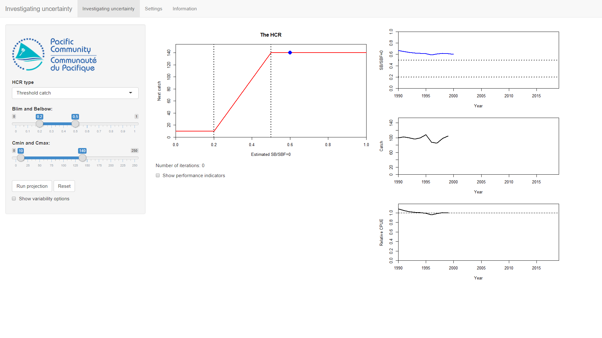
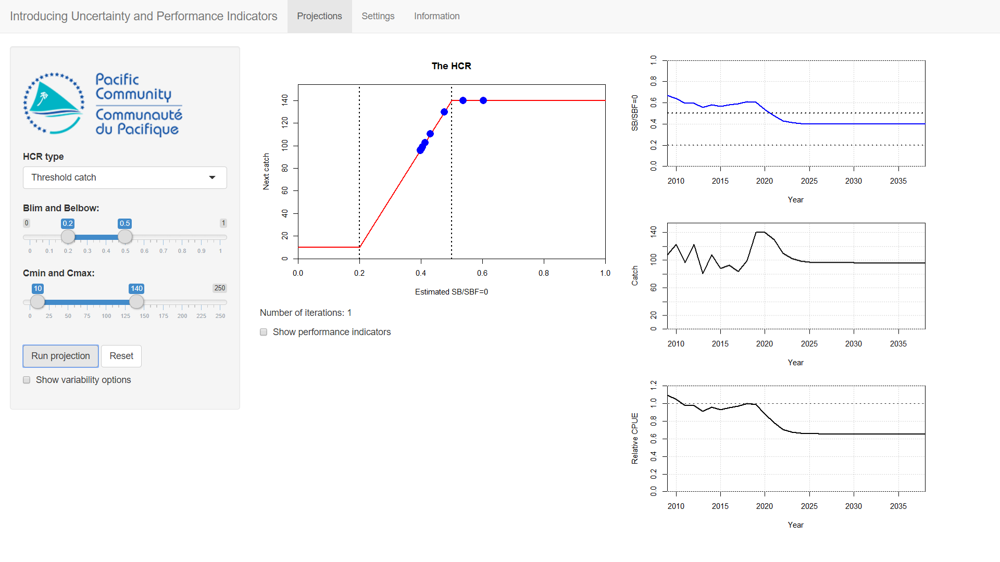
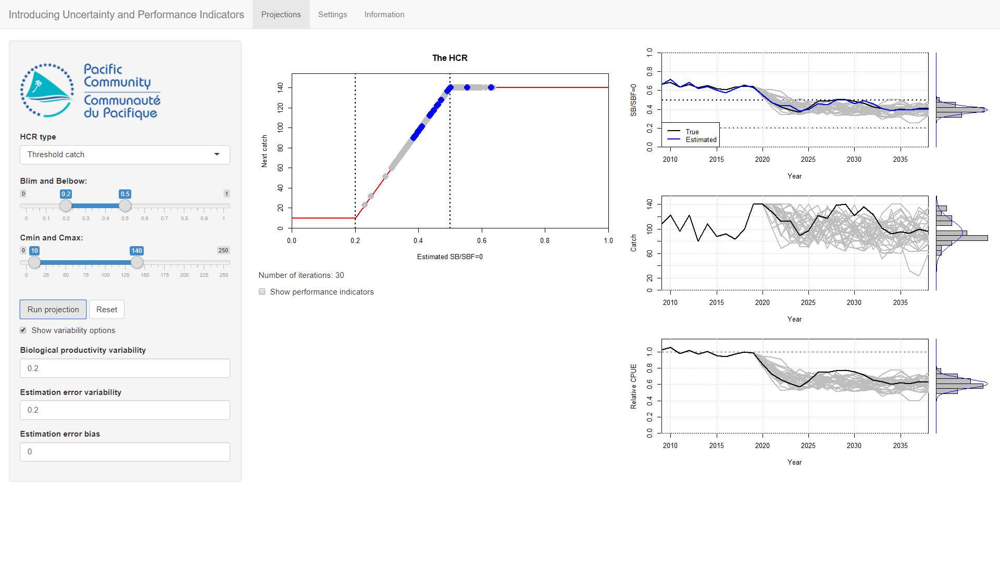
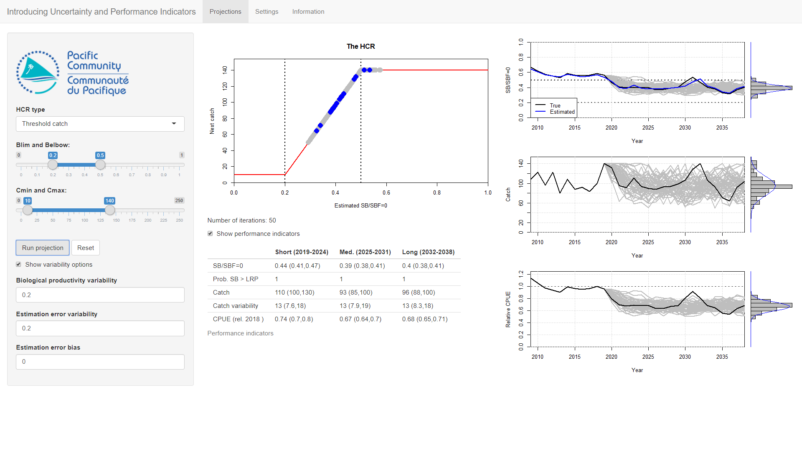
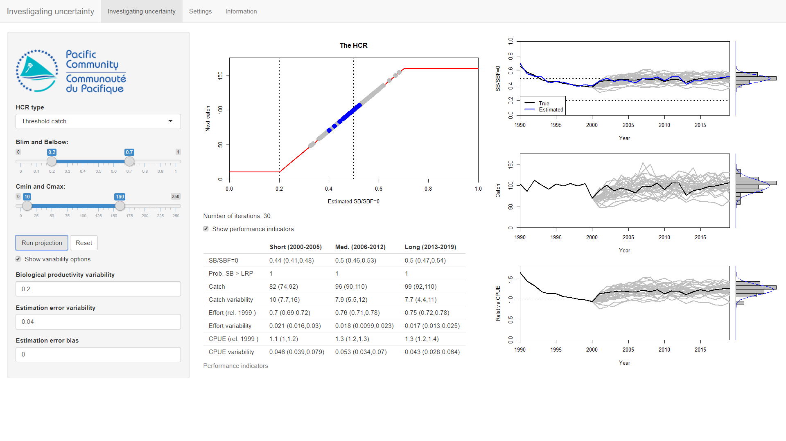

<!--use render()-->
<!-- render("tutorials/measuringPerformance.Rmd", output_format = "all")-->

# Introducing uncertainty

In the previous tutorial (*Introduction to HCRs*) we ran projections by going forward one step at a time.
This hopefully allowed us to see the basic ideas of how a HCR worked.
We also looked at two sources of uncertainty (*biological productivity variability* and *estimation error*) and saw how they can affect the performance of a HCR.
In this tutorial we build on this by running full projections with uncertainty.

Start by double-clicking on the **IntroUncertainty** file in the AMPED directory.
A black window *should* appear, followed by the app opening in a browser window.
If this does not happen, something has gone wrong. Sorry...

# Simple introduction

The layout of the app should show the HCR with three time series plots of SB/SBF=0, catch and CPUE (relative to the CPUE in 1999). The parameters of the HCR can be set using the controls on the left-hand side.

<!-- Insert image -->

The initial values of the HCR parameters are: *Blim* = 0.2, *Belbow* = 0.5, *Cmin* = 10 and *Cmax* = 140.
Click on the **Run projection** button to perform a 20 year projection (from 2000 to 2020).

<!-- Insert image -->

You should see that the time series plots now show the time series until 2020.
The HCR plot should show blue points on the parts of the HCR that were active during the projection.

Click **Run projection** again. Nothing seems to happen except weird bars at the end of the time series plots.
You may notice that the **Number of iterations** counter under the HCR plot also increased by one.
Keep clicking **Run projection**. Nothing much happens. This is boring.

What is happening?
Each time you click **Run projection** we are running a new projection.
However, we have no uncertainty in the projection so the result is exactly the same.

This is not very interesting.

# Turn on the variability

We introduced uncertainty in the previous tutorial (*Introduction to HCRs*). In this app there are two sources of uncertainty: *Biological productivity variability* and *Estimation error*.

Click on the **Show variability options** to show the uncertainty options.
Set **Biological productivity variability** to 0.2,  **Estimation error variability** to 0.04 and leave **Estimation error bias** at 0.
Keep the HCR parameters the same.

Click **Run projection**. You should see that now your projection is bumpy.
Click **Run projection** again. You should get another time series but it is different to the previous one (the previous one is in grey, the new one in black).
This second projection has the same stock and the same HCR as the first one but the outcome is different.
The difference is a result of the uncertainty in the biological productivity and the estimation error.
The different projections are known as iterations.

The black line shows the current iteration (projection), the grey line the past iterations.
This is the same on the HCR plot - the grey dots show the past iterations.

Click **Run projection** again and again. More lines will appear.
The bars at the end of the time series plots are histograms of the values in the final year of the projection.
These histograms will fill in the more projections you run.

Keep clicking **Run projection** until you get 30 or more iterations.
You can see the distribution of the final values of the projection start to settle down.
This means that we are starting to capture the uncertainty in our projected values.
As you keep clicking this distribution will settle down. When this happens we are more certain about the impact of uncertainty and get estimates of the distributions of values.

<!-- Insert image -->

When testing a HCR through simulation we don't run just one projection, we run lots of them.
How many depends on the sources of uncertainty, the life history of the stock etc. We need the distribution to settle down.

These types of projections with uncertainty are different to running a single deterministic (non-random) projection. 
If we want to understand how uncertainty may affect the performance of a HCR in the real world, running a deterministic projection is not enough.

We need to select a HCR that is robust to the uncertainty.
The big question is how to choose HCR a preferred HCR?

You need some way of comparing performance. So how do you mention performance?

# Introducing performance indicators

Press the **Reset** button.
We are interested in measuring how well the HCR is performing.
To do this we can use Performance Indicators (PIs) to measure different metrics. Lots of different PIs are available that measure different things, for example, catch levels, changes in effort, probability of SB/SBF=0 being above the LRP etc. 
The PIs should relate to the management objectives for the fishery and allow you to measure how well the fishery is performing in relation to those objectives. Some HCRs will perform well for some PIs and poorly for others. This is where the ideas of prioritising PIs and evaluating trade-offs come in.

Click on the **Show performance indicators** button. Nothing happens - yet.
With the HCR and uncertainty parameters set as before, cLick the **Run projection** button.
You should see that a table has appeared with various PIs over different time periods.
The PIs are in the rows in the table.
The different time periods (short-, medium- and long-term) are the columns.
The average value of the PIs is calculated over the differnt time periods.

At the time of writing there are 8 indicators. Don't worry about all of them for the moment.
Just look at *SB/SBF=0*, *Prob. SB > LRP* (the probability of SB/SBF=0 being above the LRP), *Catch* and *CPUE (rel. 1999)* for now.
<!-- And stability?-->

Click the **Run projection** button again so that we have two iterations. Notice that the values in the table have changed.
We now have two extra values for each PI in ().
The single value is the median of the two iterations. The values in the () are the 20 and 80 percentile.
It doesn't make much sense to calculate this for just 2 iterations.

Keep clicking **Run projection** until you have about 30 iterations.
You should see that the numbers update in the table but start to settle down (in the same way that the histogram settles down).

Take note of the long-term values of *SB/SBF=0*, *Prob. SB > LRP*, *catch* and *CPUE (rel. 1999)*.

<!-- SB/SBF=0: 0.4 (0.38, 0.42) Catch: 95 (90, 110) Rel. CPUE: 0.59 (0.57, 0.63) -->

# Another HCR 

We can do this again for a different HCR.
Set these parameters: *Blim* = 0.2, *Belbow* = 0.7, *Cmin* = 10 and *Cmax* = 160.
Keep the same uncertainty options as before.

Click **Run projection** about 30 times and note down the long-term behaviour of SB/SBF=0, catch and relative CPUE.

<!--  SB/SBF=0: 0.5 (0.48, 0.52) Catch: 100 (93, 110) Rel. CPUE: 0.85 (0.81, 0.90) -->

The catches and probability of being above the LRP look about the same, but SB/SBF=0 and CPUE are higher for the second HCR.
This means if we only considered these four PIs in the long-term you would probably pick the second HCR instead of the first one.

# Summary

When we simulate the performance of a HCR we don't run just one projection, we run lots. How many depends on the sources of uncertainty, the life history of the stock etc. We need the distribution to settle down.

This means we don't have just one value for the results but a distribution of values.
We need to summarise these. Here we use the median and the 20, 80 percentile.

