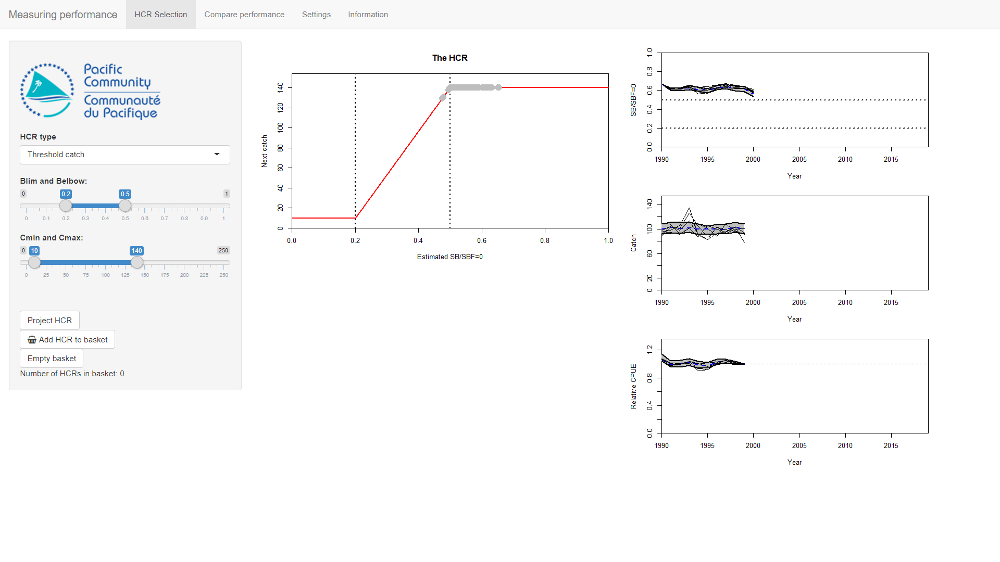
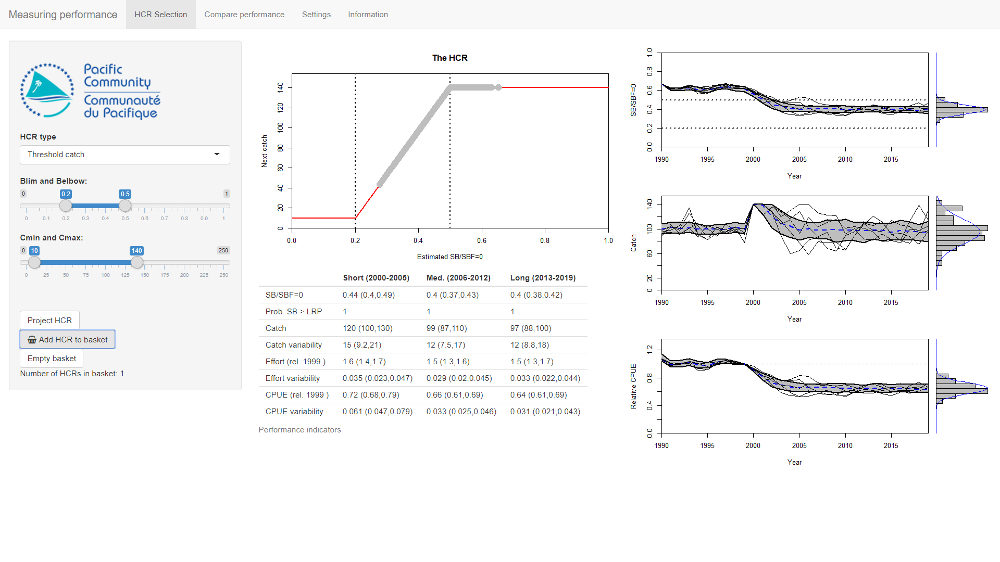
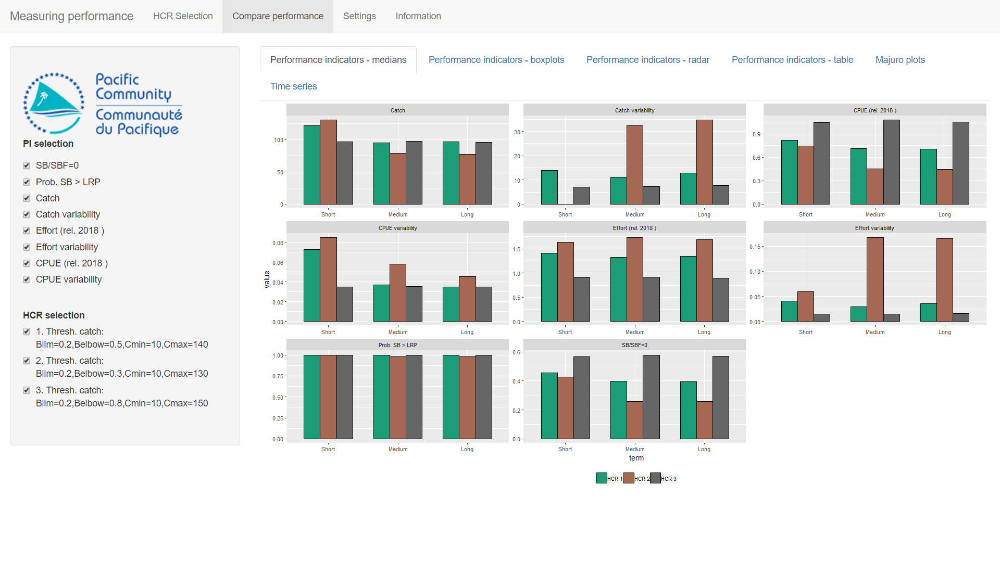
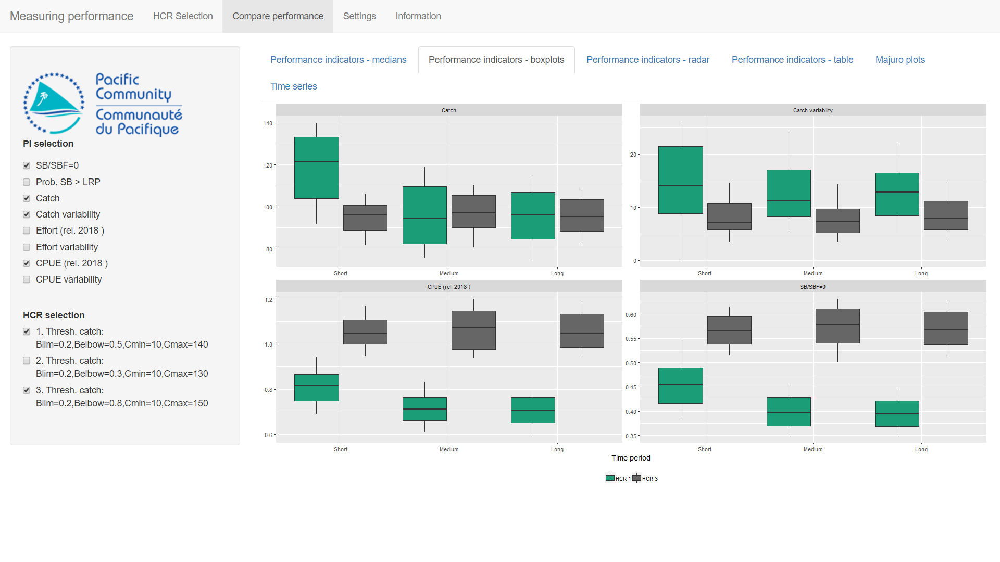
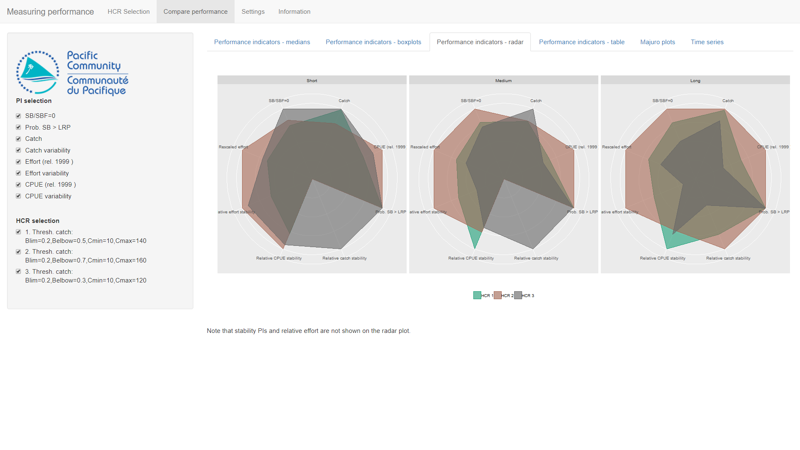

<!--use render()-->
<!-- render("tutorials/measuringPerformance.Rmd", output_format = "all")-->

# Measuring performance

In the previous tutorial (*Introduction to uncertainty*) we ran projections one iteration at a time.
We included two sources of uncertainty (*biological productivity variability* and *estimation error*) and began to look how to compare the performance of different HCRs using Performance Indicators (PIs).
In this tutorial we build on this by assembling a basket of candidate HCRs and comparing their performance in a number of ways.

Start by double-clicking on the **MeasuringPerformance** file in the AMPED directory.
A black window *should* appear, followed by the app opening in a browser window.
If this does not happen, something has gone wrong. Sorry...

<!-- Insert image -->

You should be presented with the familiar HCR plot on the left of the main panel, and three time series plots on the right of the main panel which show SB/SBF=0, catch and CPUE relative to the CPUE in the year 1999.
The uncertainty is already switched on and the time series plots already have multiple iterations (the default is 100 iterations).
The grey envelopes contain the 20-80 percentile values and the blue, dashed line is the median. Some individual trajectories are also shown (known as spaghetti).

We are going to run a series of projections with multiple iterations to test the performance of various HCRs
The basic process we will follow here is:

* Set up a HCR using the HCR parameters on the left-hand side;
* Project the stock forward in time under that HCR (by pressing the **Project HCR** button);
* Have a quick check of the resulting time series plots and PI values;
* If you like the HCR, add it to the basket of candidate HCRs (by pressing the **Add HCR to basket** button);
* When you have several HCRs in the basket, go to the **Compare performance** tab and take a look at relative performance of them.

# A quick example

## Setting up HCRs, running projections and adding to the basket

The initial values of the HCR parameters are: *Blim* = 0.2, *Belbow* = 0.5, *Cmin* = 10 and *Cmax* = 140.
Press the **Project HCR** button to run the projection.
This runs a projection with 100 iterations. The results can be seen in the time series plots and the table of PIs.

There are 8 PIs in the table. *SB/SBF=0* and *Catch* are fairly self explanatory. *Effort (rel. 1999)* and *CPUE (rel. 1999)* are the fishing effort and CPUE relative to their values in 1999 respectively. *Prob. SB > LRP* is the probability of of SB/SBF=0 being above the LRP. *Catch variability*, *Effort variability* and *CPUE variability* measure the variability in the catch, relative effort and relative CPUE respectively. They measure how much the catch etc. change over the time (the bumpiness in the plots). The higher the value, the more the value changes over time.

It should be noted that the PIs don't all point the same way. 
It is generally thought that the higher the value of *SB/SBF=0*, *Prob. SB > LRP*, *Catch* and *CPUE (rel. 1999)* the better the HCR is performing.
However, for *Effort (rel. 1999)* and the *variability* PIs, lower values are preferred. The higher the effort, the greater the costs. Stable catches and effort are preferred to catches and effort that varying strongly between years.
Care must therefore be taken when using PIs to compare performance of HCRs.

Click on the **Add HCR to basket** button to add the HCR to the basket of candidate HCRs. You should see that the counter **Number of HCRs in basket** increases by 1.

<!-- Insert image -->

Repeat this process (set up, run, add) for two other HCRs.
Use the following parameters:

HCR2: *Blim* = 0.2, *Belbow* = 0.7, *Cmin* = 10 and *Cmax* = 160. 

HCR3: *Blim* = 0.2, *Belbow* = 0.3, *Cmin* = 10 and *Cmax* = 120. 

You should now have three HCRs in your basket (check the counter).

## Comparing performance

We can now compare the performance of the three HCRs. Select the **Compare performance** tab at the top of the app window.
You should see bar plots of the median values of the PIs (in each panel), of each HCR in the basket (the different colours) in the three different time periods (short-, medium- and long-term).

<!-- Insert image -->

It should be noted that in this plot the 'upside down' PIs (*Effort (rel. 1999)* and the *variability* PIs) have been transformed so that the higher the value the better. The variability PIs now measure the relative stability. The higher the value, the more stable the values.

There is a lot of information presented here. PIs that are thought to be unimportant (perhaps they do not measure anything related to your management objectives) can be dropped by deselecting them from the list in the left panel.
Similarly, HCRs can be deselected if they are thought to be of no interest.

<!--
Looking at the bar plots of median values we can start to compare the perforance.
To make our life a bit easier deselect the relative effort stability and relative CPUE stability PI from the list on the left.
-->

For example, we might think that the effort variability and CPUE variability do not matter to us.
Deselect them from the list on the left.
This gives us 6 PIs left to consider.

Which of these three HCRs is performing better?
Considering the medium-term period only, HCR2 has the highest CPUE but HCR3 has the highest catches.
HCR3 has the highest effort, which means higher costs, which might make it less desirable.
HCR2 has the highest catch stability.

The different HCRs have different values for SB / SBF=0 but the probability of being above the LRP is 1 for all of them so does measuring SB / SBF=0 matter?

## Other methods of comparison

The **Compare performance** tab has six different sub-tabs at the top that allow you to explore the performance of the HCRs in different ways. Looking at the bar plots of the medians does not tell us about the distribution of values and effectively ignores the uncertainty. You can see the uncertainty by looking at the **Performance indicators - boxplots** tab.

You can see that the different HCRs have different levels of uncertainty in the PIs. For example, HCR3 has the highest values of the CPUE but it also has the widest distribution of values meaning it is less certain. This might be worth considering when selecting a preferred HCR.

Note that on the box plot, the 'upside down' PIs (*Effort (rel. 1999)* and the *variability* PIs) have not been transformed. This means that lower values of variability and effort are thought to be better. This does make comparison a bit tricky. Sorry.

You can also look at **Performance indicators - radar** for radar plots (if you like them...).
The 'upside down' PIs have been transformed for the radar plot so the larger the area, the better the HCR is thought to be performing.

**Performance indicators - table** has a table of PI values in the long-term (he 'upside down' PIs have not been transformed so that lower variability and effort values are better).
**Majuro plots** has a Majuro plot with the different stock trajectories on.
**Time series** has time series plots of various metrics.

With all of them you can select and deselect the HCRs to help compare the performances.

If you return to the *HCR Selection* tab and press the *Empty basket* you will empty all the HCRs from your basket.

You should decide which PIs are the most important to you (i.e. have the highest priority) and then try to find a HCR that performs the best.

# Summary

Choosing a preferred HCR is not a trivial task. It is possible to calculate many different indicators to meaure their performance. The distribution of these indicators should be considered as well as their central (median or average) value. Additionally, you can have different time periods to consider.

It may not be possible to find a HCR that performs well for all the chosen PIs. In this case PIs should be considered in order of their priority and trade-offs will need to be evaluated.

<!--
# Now you try

Go back to the **HCR Selection** tab and press the **Empty basket** button to get rid of all the HCRs from the basket.

Set up, run and store a range of HCRs (as many as you want: 5, 10, more...).

Keep Cmin at 10

2 Competitions

Your mission is to find a HCR that gives you:

Catch > 90
Highest CPUE
-->

<!-- 
(0.2, 0.7, 10, 160)
(0.2, 0.4, 10, 90)
(0.1, 0.7, 10, 100)
Second one has more stability

Talk through these three - all meet the constraint - but different stability and effort etc.
Majuro also

-->

