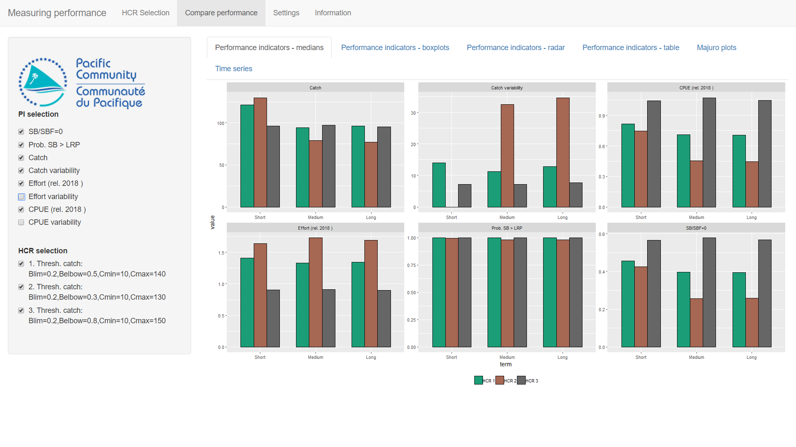
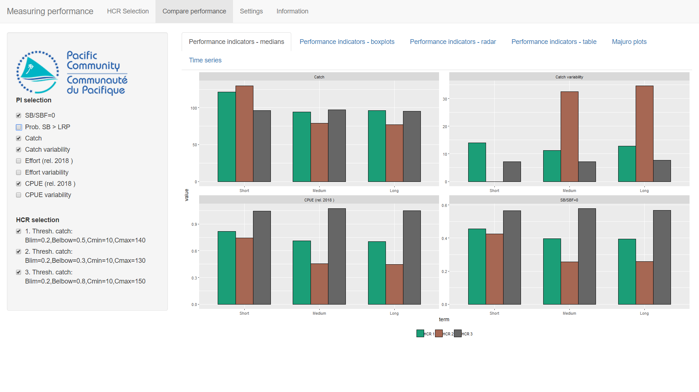
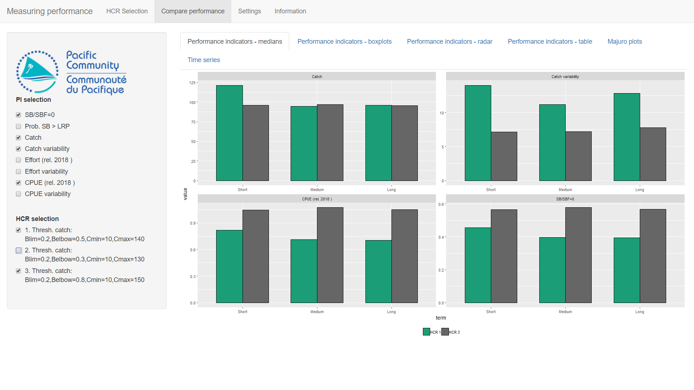
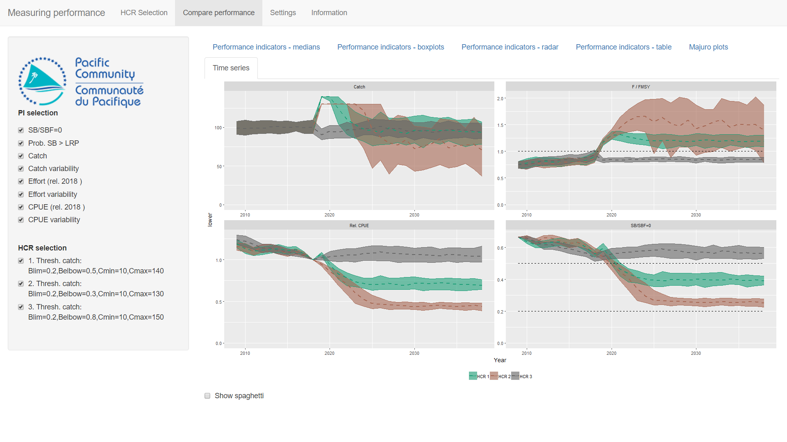

<!--use render()-->
<!-- render("tutorials/measuringPerformance.Rmd", output_format = "all")-->

# Introduction

In the previous tutorial (*Introduction to Uncertainty and Performance Indicators*) we looked at the performance of HCRs by running a large number of individual projections. 
We included two sources of uncertainty (*biological productivity variability* and *estimation error*) and began to look at how to compare the performance of different HCRs using Performance Indicators (PIs).
The more iterations (number of projections) we had, the better the estimate of uncertainty in the PIs.

In this tutorial we build on this by assembling a basket of candidate HCRs, calculating a range of PIs and comparing their performance in a number of ways.

# Getting Started

Start by double-clicking on the **MeasuringPerformance** file in the *AMPED* directory.
A black window *should* appear, followed by the app opening in a browser window.
If this does not happen, something has gone wrong. Sorry...

<!-- Insert image -->

You should be presented with the familiar HCR plot and three time series plots which show SB/SBF=0, catch and CPUE relative to the CPUE in the year 2018.
Uncertainty is already switched on (*biological productivity variability* and *estimation error*) and the time series plots already have multiple iterations (the default is 100 iterations).
In the time series plots, the grey envelopes contain the 20-80 percentile values and the blue, dashed line is the median. Some individual trajectories are also shown (known as spaghetti).

# Comparing Performance

We are going to compare the performance of some HCRs in a number of different ways.
We will do this by running projections with multiple iterations for the different HCRs and then calculating a range of PIs.
The PIs can then be analysed in a number of different ways.

The basic process we will follow here is:

* Set up a HCR using the HCR parameters on the left-hand side;
* Project the stock forward in time under that HCR (by pressing the **Project HCR** button);
* Have a quick check of the resulting time series plots and PI values;
* If you like the HCR, add it to the basket of candidate HCRs (by pressing the **Add HCR to basket** button);
* When you have several HCRs in the basket, go to the **Compare performance** tab and take a look at their relative performance. 

# An example

## Setting up HCRs, running projections and adding to the basket

The initial values of the HCR parameters should be: *Blim* = 0.2, *Belbow* = 0.5, *Cmin* = 10 and *Cmax* = 140. If not, set these parameters.
Press the **Project HCR** button to run the projection.
This runs a projection with 100 iterations. In the previous tutoral we ran one iteration at a time. Now we are running a 100 at a time. The results can be seen in the time series plots and the table of PIs 
(hopefully, this looks familiar to the previous tutorial).

There are 8 PIs in the table. *SB/SBF=0* and *Catch* are fairly self explanatory. *Effort (rel. 2018)* and *CPUE (rel. 2018)* are the fishing effort and CPUE relative to their values in 2018 respectively. *Prob. SB > LRP* is the probability of SB/SBF=0 being above the LRP. *Catch variability*, *Effort variability* and *CPUE variability* measure the variability in the catch, relative effort and relative CPUE respectively. They measure how much the catch etc. change over the time (the bumpiness in the plots). The higher the value, the more the value changes over time.

It should be noted that we don't necessarily want high values for all of the PIs.
It is generally thought that the higher the value of *Prob. SB > LRP*, *Catch* and *CPUE (rel. 1999)* the better the HCR is performing.

However, for *Effort (rel. 1999)* and the three *variability* PIs, lower values are preferred. High effort implies high costs (something we want to avoid).
Stable catches and effort are preferred to catches and effort that varying strongly between years.

SB/SBF=0 is slightly more complicated. We don't want this value to be too low (we want it away from the LRP). However, high values of SB/SBF=0 imply that there is some forgone catches. Ideally, SB/SBF=0 should be measured against the TRP.

Care must therefore be taken when using PIs to compare performance of HCRs. Not all of them should be high.

Looking at the summary plots and the table of PIs, we think that this HCR is worth considering in more detail.
Click on the **Add HCR to basket** button to add the HCR to the basket of candidate HCRs. You should see that the counter **Number of HCRs in basket** increases by 1.

<!-- Insert image -->

Repeat this process (set up the HCR, run the projection, add to the basket) for two other HCRs.
Use the following parameters:

* HCR2: *Blim* = 0.2, *Belbow* = 0.3, *Cmin* = 10 and *Cmax* = 130. 
* HCR3: *Blim* = 0.2, *Belbow* = 0.8, *Cmin* = 10 and *Cmax* = 150. 

You should now have three HCRs in your basket (check the counter).

## Comparing performance

We can now compare the performance of the three HCRs. Select the **Compare performance** tab at the top of the app window.
You should see a lot of bar plots.
Each panel shows the median (average) value of a PI for each of the HCRs in the basket, in the three different time periods (short-, medium- and long-term). Each HCR has a different colour.

<!-- Insert image -->

<!--
FIX THIS
It should be noted that in this plot the 'upside down' PIs (*Effort (rel. 1999)* and the *variability* PIs) have been transformed so that the higher the value the better. The variability PIs now measure the relative stability. The higher the value, the more stable the values.
-->
We are looking at the median values of 8 PIs for 3 HCRs in 3 different time periods.
This is a lot of information! We want to be able to choose which HCR best fits our objectives but it can be difficult when there is so much to look at.

To make things easier, we can drop PIs that we think are unimportant (perhaps they do not measure anything related to your management objectives) by deselecting them from the list in the left panel.
Similarly, HCRs can be deselected if they are thought to be of no interest.

For example, we might think that effort variability and CPUE variability are less important than the other PIs (catch variability might be more important).
Deselect them from the list on the left.
This still gives us 6 PIs left to consider.

<!-- Insert image -->

The results for the probability of SB/SBF=0 being above LRP look pretty similar for the three HCRs. None of them show low probability of being above the LRP. This means that this indicator is not providing us with any information to help us choose between the HCRs.
We can deselect it.

Although effort is an important indicator (high effort means high costs), we might think that CPUE is a better indicator in terms of economic performance. To make our lives easier, we can deselect effort.

We now have 4 PIs.

<!-- Insert image -->

Looking at the performance of HCR 2, we can see that in the short-term the median catches are good (compared to HCR 3), the catch variability is 0 (this is good as it means we have certainty in the catches) and the CPUE is OK (better than HCR 1 but not as good as HCR 3).
However, when considering the short- and medium-term HCR 2 does not perform well. The catches tend to be lower, the catch variability is very high, and the CPUE is low. It also has the lowest SB/SBF=0.

If we think that medium- and long-term performance is more important than short-term performance then we should probably drop HCR 2.
You can deselect it in the left-hand panel.

We now have to compare HCR 1 and HCR 3.

<!-- Insert image -->

Looking at the bar plots, which of these HCRs do you think is better?
Which PIs do you think can be ignored for the moment?
What are the main trade-offs between the PIs?

<!-- Catches and SB/SBF=0 are similarish
The main trade offs are between CPUE and Catch variability
-->

<!--
Looking at the bar plots of median values we can start to compare the perforance.
To make our life a bit easier deselect the relative effort stability and relative CPUE stability PI from the list on the left.
-->

# Other methods of comparison

The plots we have been looking at are simple bar plots that show the median value.
These plots might not be enough to allow you to choose a preferred HCR.
The **Compare performance** tab has six different sub-tabs at the top that allow you to explore the performance of the HCRs in different ways.

Looking at the bar plots of the medians does not tell us about the distribution of values and effectively ignores the uncertainty in PIs. You can see the uncertainty by looking at the **Performance indicators - boxplots** tab.

Each box contains the 20-80 percentile. The median is the black line through the middle of the box.
If the Catch PI has been deselected then reselect it. You should be able to see that although the *median* catches of HCR 1 and HCR 3 are similar in the medium- and long-term, the uncertainty of the catches from HCR 1 are higher (the box is bigger) and there is much higher chance of low catches (the bottom of the box is lower), particularly in the long-term.

Uncertainty in the future performance is generally considered to be a bad thing. Ideally, you want to be as certain as possible so you would want the boxes of a boxplot to be as small as possible. The amount of uncertainty may affect your selection of the preferred HCR.

You can also look at **Performance indicators - radar** for radar plots (if you like them...).
Radar plots scale the indicators so that the relative performance between the HCRs is shown.
Reselect all the PIs and the HCRs to witness the full glory of a radar plot.
Note that for the radar plots, the 'upside down' PIs (the 3 *variability* PIs and the effort PI) have been transformed so that larger values are considered to be better.

Other methods of comparison are also available.
**Performance indicators - table** has a table of PI values in the long-term. This can be useful for detail but can be hard to get a 'quick look' at what is going on.

**Majuro plots** has a Majuro plot with the different stock trajectories on it. 
**Time series** has time series plots of various metrics.
With all of them you can select and deselect the HCRs to help compare the performances.

Different people have different preferences for how they like the information to be presented. Different methods of presentation can reveal different features about the performance.
There is no single best way of comparing performance.

# Exercises

Return to the *HCR Selection* tab and press the *Empty basket* button.
This will empty all the HCRs from your basket.

## Exercise 1

Using a similar process as above, find an HCR that meets the following two conditions:

* Gives the highest possible catches in the short-term and
* Always has a probability of SB/SBF=0 being above the LRP of at least 0.8.

Try out as many HCRs as you want (5, 10, 20..., keep adding them to the basket), then use the different methods for exploring the performance to select the best one.
Write down your final HCR parameter settings and also why you think it is the best compared to the others.

## Exercise 2

Now find an HCR that meets these two conditions:

* Gives the highest possible CPUE in the long-term and
* Maintains catches above 100 in all time-periods.

Write down your final HCR parameter settings and also why you think it is the best compared to the others.

# Summary

Choosing a preferred HCR is not a trivial task. It is possible to calculate many different indicators to meaure their performance. The distribution of these indicators should be considered as well as their central (median or average) value. Additionally, you can have different time periods to consider.

It may not be possible to find a HCR that performs well for all the chosen PIs. In this case PIs should be considered in order of their priority and trade-offs will need to be evaluated.

